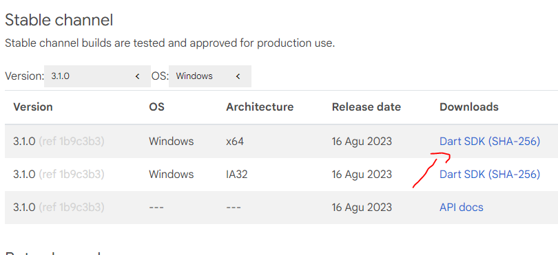
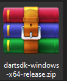
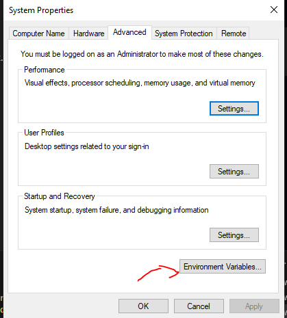
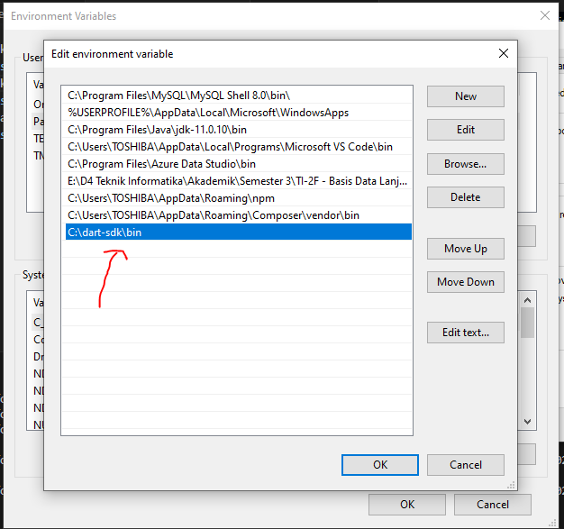
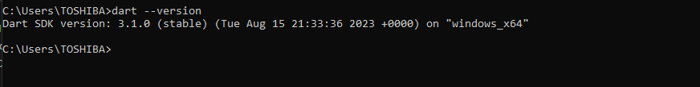
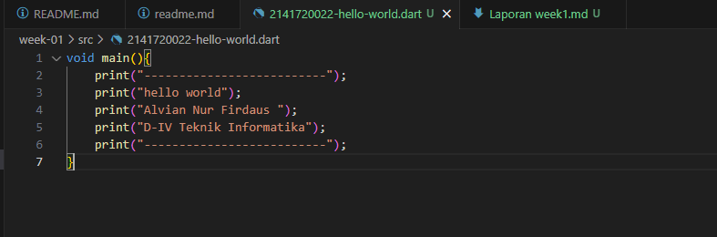
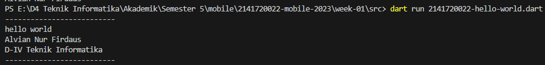

# **Laporan Praktikum**
# **Pertemuan 1**

## **Data Mahasiswa**
>

>
Nama : Alvian Nur Firdaus

>Kelas : 3H

>Prodi : D-IV Teknik Inormatika

>Jurusan : Teknologi Inormasi

>
 Politeknik Negri Malang
 

 

## 2.1 Tujuan Praktikum
Setelah melakukan materi praktikum ini, mahasiswa mampu:

1. Melakukan Instalasi Dart
2. Menjalankan Dart

 

## 2.2 Melakukan Instalasi Dart

## 2.2.1 Langkah-langkah instalasi
1. Download dart pada link berikut https://dart.dev/get-dart/archive

    >download pada panah diatas
    >>
    >ekstrak rar hasil download
    >>
    >pastikan berhasil mengekstrak
    >>
 

2. lakukan konfigurasi path pada enviroment fariabels

    >masuk ke emviroment fariabels
    >>
    >tambahkan path (new path) sesuai pada penyimpanan sdk
    >>
 

3. cek instalasi dart
    >apabila sudah berhasil maka akan tampil seperti dibaawah ini
    >>

 

 

 

## 2.3 Menjalankan Dart

## 2.3.1 Langkah-langkah menjalankan dart
1. buat file dart dengan nama berikut 2141720022-hello-world.dart

    >buat kodingan seperti berikut 
    >>
    >jalankan hasil dart menggunakan perintah run dart maka akan tampil seperti dibawah ini
    >>

 

