# **Laporan Praktikum**
# **Pertemuan 4**
### **Percabangan pada pemrograman DART, Perulangan pada pemrograman DART, Operasi Gi**
------


### **Data Mahasiswa**


><p>Nama : Alvian Nur Firdaus<p>
>NIM : 2141720022<p>
>Kelas : 3H<p>
>Prodi : D-IV Teknik Inormatika<p>
>Jurusan : Teknologi Inormasi<p>


<br>

### **Tujuan Praktikum**
Setelah menyelesaikan codelab ini Anda akan mampu untuk:

1. Menerapkan collections pada bahasa pemrograman Dart
2. Menerapkan records pada bahasa pemrograman Dart
3. Menerapkan functions pada bahasa pemrograman Dart

<br>

---------
<br>

### **Praktikum 1: Eksperimen Tipe Data List**
Selesaikan langkah-langkah praktikum berikut ini menggunakan VS Code atau Code Editor favorit Anda.

### **Langkah 1**
Ketik atau salin kode program berikut ke dalam fungsi main().

```dart
var list = [1, 2, 3];
assert(list.length == 3);
assert(list[1] == 2);
print(list.length);
print(list[1]);

list[1] = 1;
assert(list[1] == 1);
print(list[1]);
```

### **Langkah 2**
Silakan coba eksekusi (Run) kode pada langkah 1 tersebut. Apa yang terjadi? Jelaskan!

**JAWAB**<p>
Dari hasil eksekusi pada langkah 1 diatas dihasilkan output seperti gambar dibawah ini<p>
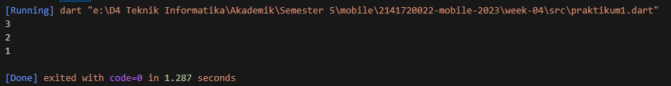<p>
Penjelasan dari kode pada langkah 1 diatas adalah membuat list dengan tiga angka, memeriksa dan mencetak panjang list serta nilai elemen kedua, mengubah elemen kedua, dan kembali memeriksa serta mencetak nilai elemen kedua yang telah diubah. Ini adalah contoh sederhana penggunaan list dan asertasi dalam bahasa Dart.<p>

### **Langkah 3**
Ubah kode pada langkah 1 menjadi variabel final yang mempunyai index = 5 dengan default value = null. Isilah nama dan NIM Anda pada elemen index ke-1 dan ke-2. Lalu print dan capture hasilnya.

Apa yang terjadi ? Jika terjadi error, silakan perbaiki.

**JAWAB**<p>

```dart
//praktikum 1
void main(){
    List<String?> list = List.filled(5, null);
    list[1] = 'Alvian Nur Firdaus';
    list[2] = '2141720022';
    print(list);
}
```
Dengan hasil output sebagai berikut <p>
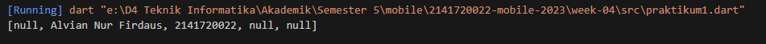<p>
kode tersebut sebuah list dengan nama list yang memiliki kapasitas 5 elemen awalnya diisi dengan nilai null. Kemudian, program mengganti nilai elemen ke-1 dari list dengan 'Alvian Nur Firdaus' dan nilai elemen ke-2 dengan '2141720022'.<p>


>**Catatan:**<p>
>Dart akan melakukan infers pada variabel list dengan tipe data List. Jika Anda mencoba menambahkan elemen berupa objek non-integer pada list, maka analyzer atau runtime akan error. Informasi lebih lanjut dapat membaca di tautan ini type inference.<p>

-----
<br>

### **Praktikum 2: Eksperimen Tipe Data Set"**
Selesaikan langkah-langkah praktikum berikut ini menggunakan VS Code atau Code Editor favorit Anda.

### **Langkah 1**
Ketik atau salin kode program berikut ke dalam fungsi main().

```dart
var halogens = {'fluorine', 'chlorine', 'bromine', 'iodine', 'astatine'};
print(halogens);
```

### **Langkah 2**
Silakan coba eksekusi (Run) kode pada langkah 1 tersebut. Apa yang terjadi? Jelaskan! Lalu perbaiki jika terjadi error.

**JAWAB**<p>
Dari hasil eksekusi pada langkah 1 diatas dihasilkan output seperti gambar dibawah ini<p>
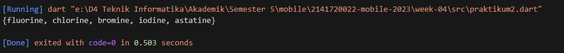<p>
Pada bagian tersebut, sebuah variabel halogens dibuat dan diinisialisasi sebagai Set dengan elemen-elemen 'fluorine', 'chlorine', 'bromine', 'iodine', dan 'astatine'. Set adalah tipe data yang mengandung elemen-elemen unik, sehingga tidak ada duplikat dalam Set.<p>

### **Langkah 3**
Tambahkan kode program berikut, lalu coba eksekusi (Run) kode Anda.

```dart
var names1 = <String>{};
Set<String> names2 = {}; // This works, too.
var names3 = {}; // Creates a map, not a set.

print(names1);
print(names2);
print(names3);
```
Apa yang terjadi ? Jika terjadi error, silakan perbaiki namun tetap menggunakan ketiga variabel tersebut. Tambahkan elemen nama dan NIM Anda pada kedua variabel Set tersebut dengan dua fungsi berbeda yaitu .add() dan .addAll(). Untuk variabel Map dihapus, nanti kita coba di praktikum selanjutnya.

Dokumentasikan code dan hasil di console, lalu buat laporannya.

**JAWAB**<p>
Berikut adalah hasil output setelah menambahkan kode program diatas<p>
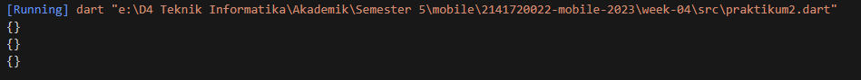<p>
Kemudian saya menambahkan kode untuk menambahkan elemen nama dan NIM pada variabel Set: pada kode program diatas hingga menjadi sperti dibawah ini<p>

```dart
void main() {
    var names1 = <String>{};
    Set<String> names2 = {};
    var names3 = {};

    names1.add('Alvian Nur Firdaus');
    names2.addAll({'Alvian Nur Firdaus', '2141720022'});

    print(names1);
    print(names2);
    print(names3);
}
```
berikut adalah hasil outputnya<p>
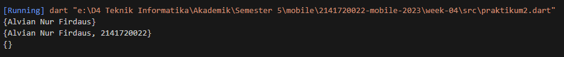<p>

----
<br>

### **Praktikum 3: Eksperimen Tipe Data Maps"**
Selesaikan langkah-langkah praktikum berikut ini menggunakan VS Code atau Code Editor favorit Anda.

### **Langkah 1**
Ketik atau salin kode program berikut ke dalam fungsi main().

```dart
var gifts = {
  // Key:    Value
  'first': 'partridge',
  'second': 'turtledoves',
  'fifth': 1
};

var nobleGases = {
  2: 'helium',
  10: 'neon',
  18: 2,
};

print(gifts);
print(nobleGases);
```

### **Langkah 2**
Silakan coba eksekusi (Run) kode pada langkah 1 tersebut. Apa yang terjadi? Jelaskan! Lalu perbaiki jika terjadi error.

**JAWAB**<p>
Dari hasil eksekusi pada langkah 1 diatas dihasilkan output seperti gambar dibawah ini<p>
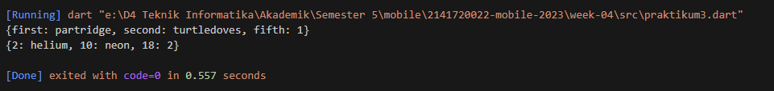<p>
Kode pemrograman Dart di atas mengilustrasikan penggunaan tipe data Map. <p>
Variabel gifts adalah sebuah Map yang memiliki tiga pasangan key-value:'first' adalah key dengan value'partridge',  'second' adalah key dengan value 'turtledoves', 'fifth' adalah key dengan value 1.
Ini menunjukkan bahwa dalam Map, key dan value dapat berupa tipe data String dan int.<p>

Variabel nobleGases adalah Map lain yang memiliki tiga pasangan key-value: 2 adalah key dengan value 'helium', 10 adalah key dengan value 'neon', 18 adalah key dengan value 2. Dalam hal ini, key dan value juga dapat berupa tipe data int dan String, menunjukkan fleksibilitas tipe data dalam Map Dart.

### **Langkah 3**
Tambahkan kode program berikut, lalu coba eksekusi (Run) kode Anda.

```dart
var mhs1 = Map<String, String>();
gifts['first'] = 'partridge';
gifts['second'] = 'turtledoves';
gifts['fifth'] = 'golden rings';

var mhs2 = Map<int, String>();
nobleGases[2] = 'helium';
nobleGases[10] = 'neon';
nobleGases[18] = 'argon';
```

Apa yang terjadi ? Jika terjadi error, silakan perbaiki.

Tambahkan elemen nama dan NIM Anda pada tiap variabel di atas (gifts, nobleGases, mhs1, dan mhs2). Dokumentasikan hasilnya dan buat laporannya!

**JAWAB**<p>
Setelah penambahan kode program diatas dijalankan hasil outputnya masih sama seperti sebelumnya karena tidak ada kode yang mengubah outputnya, seperti berikut ini<p>
<p>
maka perlu menambahkan kode untuk elemen nama dan nim pada map seperti berikut ini

```dart
//praktikum 3
void main () {
    var gifts = {
        // Key:    Value
        'first': 'partridge',
        'second': 'turtledoves',
        'fifth': 1
    };
    
    var nobleGases = {
        2: 'helium',
        10: 'neon',
        18: 2,
    };
    
    // print(gifts);
    // print(nobleGases);

    var mhs1 = Map<String, String>();
    gifts['first'] = 'partridge';
    gifts['second'] = 'turtledoves';
    gifts['fifth'] = 'golden rings';

    var mhs2 = Map<int, String>();
    nobleGases[2] = 'helium';
    nobleGases[10] = 'neon';
    nobleGases[18] = 'argon';

    mhs1['nama'] = 'Alvian Nur Firdaus';
    mhs1['nim'] = '2141720022';

    mhs2[1] = 'Alvian Nur Firdaus';
    mhs2[2] = '2141720022';

    print(gifts);
    print(nobleGases);
    print(mhs1);
    print(mhs2);
}
```

dengan hasil output sebagai berikut<p>
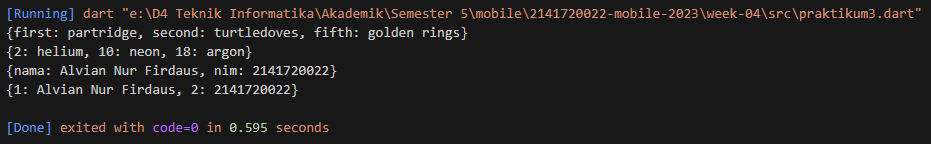<p>

----
<br>

### **Praktikum 4: Eksperimen Tipe Data List: Spread dan Control-flow Operators**
Selesaikan langkah-langkah praktikum berikut ini menggunakan VS Code atau Code Editor favorit Anda.

### **Langkah 1**
Ketik atau salin kode program berikut ke dalam fungsi main().

```dart
var list = [1, 2, 3];
var list2 = [0, ...list];
print(list1);
print(list2);
print(list2.length);
```

### **Langkah 2**
Silakan coba eksekusi (Run) kode pada langkah 1 tersebut. Apa yang terjadi? Jelaskan! Lalu perbaiki jika terjadi error.

**JAWAB**<p>
Terjadi eror seperti gambar dibawah ini <p>
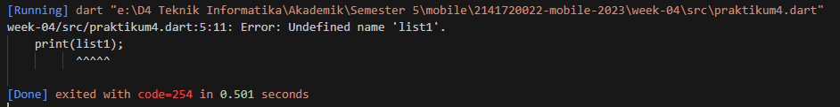<p>
hal ini terjadi karena Nama variabel list yang digunakan di baris ke-3 seharusnya list1 (tidak list).
Perubahan menggunakan operator spread (...) di baris ke-4 seharusnya var list2 = [0, ...list1]; (bukan list), dan berikut adalah hasil perbaikan kode programnya.

```dart
void main() {
  var list1 = [1, 2, 3];
  var list2 = [0, ...list1];
  print(list1);
  print(list2);
  print(list2.length);
}
```
dan berikut hasil outputnya setelah diperbaiki<p>
 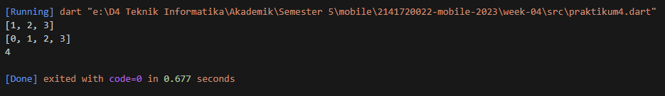<p>


### **Langkah 3**
Tambahkan kode program berikut, lalu coba eksekusi (Run) kode Anda.

```dart
list1 = [1, 2, null];
print(list1);
var list3 = [0, ...?list1];
print(list3.length);
```

Apa yang terjadi ? Jika terjadi error, silakan perbaiki.

Tambahkan variabel list berisi NIM Anda menggunakan Spread Operators. Dokumentasikan hasilnya dan buat laporannya!

**JAWAB**<p>
Akan terjadi eror seperti gambar dibawah ini<p>
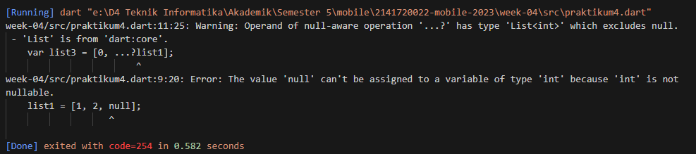<p>
Maka kemudian saya memperbaiki kode program menjadi seperti dibawah ini

```dart
void main(){
    List<int?> list = [1, 2, 3];
    var list2 = [0, ...list];
    print(list);
    print(list2);
    print(list2.length);

    list = [1, 2, null];
    print(list);
    var list3 = [0, ...list];
    print(list3.length);
}
```
Dan eror pun sudah tidak ada dan menghasilkan output seperti gambar dibawah ini<p>
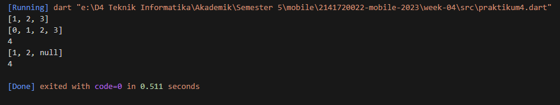<p>
kemudian saya menambahkan variabel list berisi NIM Anda menggunakan Spread Operators sesuai intruksi menjadi seperti dibawah ini

```dart
void main(){
    List<int?> list = [1, 2, 3];
    var list2 = [0, ...list];
    print(list);
    print(list2);
    print(list2.length);

    list = [1, 2, null];
    print(list);
    var list3 = [0, ...list];
    print(list3.length);

    var nimA = [2, 1, 4, 1, 7];
    var nimB = [2, 0, 0, 2, 2];
    var list4 = [...nimA, ...nimB];
    print(list4);
    print(list4.length);
}
```
Dan Hasil outputnya adalah sebagai berikut<p>
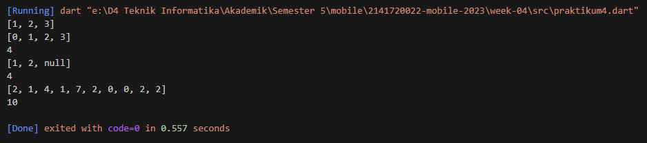<p>


### **Langkah 4**
Tambahkan kode program berikut, lalu coba eksekusi (Run) kode Anda.

```dart
var nav = ['Home', 'Furniture', 'Plants', if (promoActive) 'Outlet'];
print(nav);
```

Apa yang terjadi ? Jika terjadi error, silakan perbaiki. Tunjukkan hasilnya jika variabel promoActive ketika true dan false.

**JAWAB**<p>
Hasilnya adalah terjadi eror seperti berikut <p>
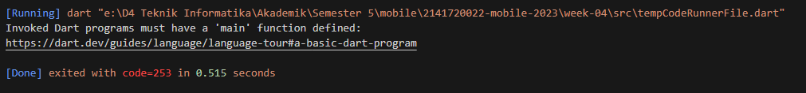<p>
hal ini terjadi error karena variable promoActive tidak didefinisikan. Kemudian saya mengubahnya menjadi seperti berikut:

```dart
void main(){
    var promoActive = true;
    var nav = ['Home', 'Furniture', 'Plants', if (promoActive) 'Outlet'];
    print(nav);
}
```
Maka akan menghasilkan output seperti berikut <p>
promoActive = true <p>
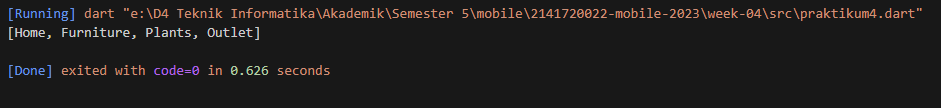<p>
promoActive = false <p>
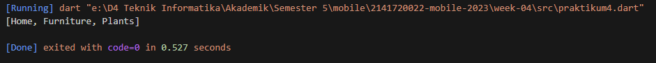<p>

### **Langkah 5**
Tambahkan kode program berikut, lalu coba eksekusi (Run) kode Anda.

```dart
var nav2 = ['Home', 'Furniture', 'Plants', if (login case 'Manager') 'Inventory'];
print(nav2);
```

Apa yang terjadi ? Jika terjadi error, silakan perbaiki. Tunjukkan hasilnya jika variabel login mempunyai kondisi lain.

**JAWAB**<p>
terjadi eror seperti gambar dibawah<p>
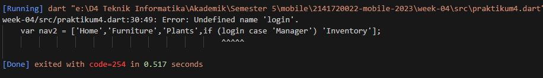<p>
hal tersebut terjadi karena variable login tidak didefinisikan. Kemudian saya mengubahnya menjadi seperti berikut:

```dart
void main(){
    String login = 'Manager';

    var nav2 = ['Home','Furniture','Plants',if (login case 'Manager') 'Inventory'];
    print(nav2);
}
```
maka hasil outputnya akan menjadi seperti berikut <p>
Ketika dijalankan dengan login = 'Manager'<p>
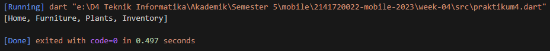<p>
Ketika dijalankan dengan login = 'User'<p>
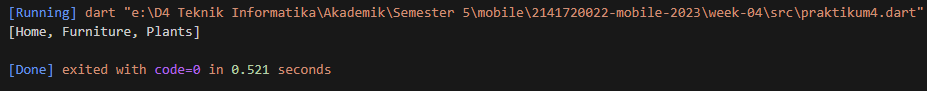<p>

### **Langkah 6**
Tambahkan kode program berikut, lalu coba eksekusi (Run) kode Anda.

```dart
var listOfInts = [1, 2, 3];
var listOfStrings = ['#0', for (var i in listOfInts) '#$i'];
assert(listOfStrings[1] == '#1');
print(listOfStrings);
```
Apa yang terjadi ? Jika terjadi error, silakan perbaiki. Jelaskan manfaat Collection For dan dokumentasikan hasilnya.

**JAWAB**<p>
Kode program diatas menghasilkan output seperti berikut<p>
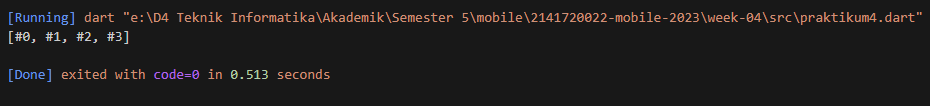<p>
Pada contoh kode Dart tersebut, "collection for" digunakan untuk membuat daftar listOfStrings dengan mengulangi elemen-elemen dalam listOfInts dan menggabungkannya dengan tanda pagar (#). Hasilnya adalah listOfStrings berisi ['#1', '#2', '#3'], yang kemudian diperiksa apakah elemen kedua adalah '#2' menggunakan assert. Terakhir, isi dari listOfStrings dicetak ke konsol.

------
<br>

### **Praktikum 5: Eksperimen Tipe Data Records**

>Catatan: Tipe data Records mulai diperkenalkan pada Dart versi 3.0. Pastikan Anda sudah setup menggunakan Dart 3.0 atau yang lebih baru.

Selesaikan langkah-langkah praktikum berikut ini menggunakan VS Code atau Code Editor favorit Anda.

### **Langkah 1**
Ketik atau salin kode program berikut ke dalam fungsi main().

```dart
var record = ('first', a: 2, b: true, 'last');
print(record)
```

### **Langkah 2**
Silakan coba eksekusi (Run) kode pada langkah 1 tersebut. Apa yang terjadi? Jelaskan! Lalu perbaiki jika terjadi error.

**JAWAB**<p>
Awalnya terjadi eror karena kurang penambahan ';' pada setelah perintah print, kemudian saya menambahkanya dan didapati hasil seperti berikut ini <p>
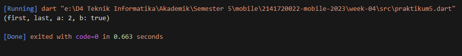<p>

### **Langkah 3**
Tambahkan kode program berikut di luar scope void main(), lalu coba eksekusi (Run) kode Anda.

```dart
(int, int) tukar((int, int) record) {
  var (a, b) = record;
  return (b, a);
}
```

Apa yang terjadi ? Jika terjadi error, silakan perbaiki. Gunakan fungsi tukar() di dalam main() sehingga tampak jelas proses pertukaran value field di dalam Records.

**JAWAB**<p>
berikut setelah saya tambahkan kode diatas

```dart
(int, int) tukar((int, int) record) {
  var (a, b) = record;
  return (b, a);
}

void main() {
  var record = (1, 2);
  print(record);
  print(tukar(record));
}
```
berikut adalah hasil output setelah saya menabahkan kode diatas dan menghasilkan output seperti berikut<p>
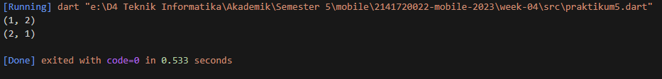<p>

### **Langkah 4**
Tambahkan kode program berikut di dalam scope void main(), lalu coba eksekusi (Run) kode Anda.

```dart
// Record type annotation in a variable declaration:
(String, int) mahasiswa;
print(mahasiswa);
```

Apa yang terjadi ? Jika terjadi error, silakan perbaiki. Inisialisasi field nama dan NIM Anda pada variabel record mahasiswa di atas. Dokumentasikan hasilnya dan buat laporannya!

**JAWAB**<p>
setelah saya menjalankan kode program tersebut terjadi eror seperti berikut<p>
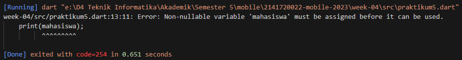<p>
Hal tersebut terjadi karena  nilainya belum diinisialisasi, berikut setelah saya tambahkan kode untuk inisialisasi

```dart
void main() {
  (String, int) mahasiswa = ('Alvian Nur Firdaus', 2141720022);
  print(mahasiswa);
}
```
maka didapati hasil output seperti berikut <p>
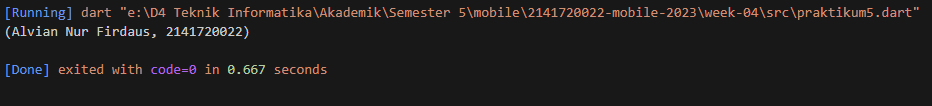<p>

### **Langkah 5**
Tambahkan kode program berikut di dalam scope void main(), lalu coba eksekusi (Run) kode Anda.

```dart
var mahasiswa2 = ('first', a: 2, b: true, 'last');

print(mahasiswa2.$1); // Prints 'first'
print(mahasiswa2.a); // Prints 2
print(mahasiswa2.b); // Prints true
print(mahasiswa2.$2); // Prints 'last'
```

Apa yang terjadi ? Jika terjadi error, silakan perbaiki. Gantilah salah satu isi record dengan nama dan NIM Anda, lalu dokumentasikan hasilnya dan buat laporannya!

**JAWAB**<p>
Setelah saya menambahkan kode program diatas tidak terjadi eror dan menghasilkan output sebagai berikut <p>
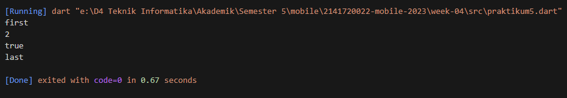<p>
kemudian saya melakukan modifikasi kode program dengan mengganti salah satu isi record dengan nama dan Nim saya menjadi sepeperti dibawah ini

```dart
void main() {
  var mahasiswa2 = ('Alvian Nur Firdaus', a: 2141720022, b: true, 'last');

  print(mahasiswa2.$1);
  print(mahasiswa2.a);
  print(mahasiswa2.b);
  print(mahasiswa2.$2);
}
```
Dan menghasilkan output seperti gambar dibawah ini <p>
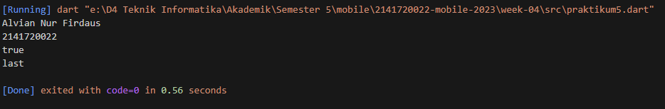<p>


------
<br>

### **Tugas Praktikum**
1. Silakan selesaikan Praktikum 1 sampai 5, lalu dokumentasikan berupa screenshot hasil pekerjaan Anda beserta penjelasannya!<p>

    >**Jawab**<p>
    > Sudah saya jawab dan jelaskan pada praktikum 1, 2, 3, 4 dan 5 tadi diatas atau juga bisa mengklik link dibawah kemudia diarahkan keatas secara otomatis
    >- [Praktikum 1 (klik)](#praktikum-1-eksperimen-tipe-data-list)
    >- [Praktikum 2 (klik)](#praktikum-2-eksperimen-tipe-data-set)
    >- [Praktikum 3 (klik)](#praktikum-3-eksperimen-tipe-data-maps)
    >- [Praktikum 4 (klik)](#praktikum-4-eksperimen-tipe-data-list-spread-dan-control-flow-operators)
    >- [Praktikum 5 (klik)](#praktikum-5-eksperimen-tipe-data-records)<p>
    > 
<p>

2. Jelaskan yang dimaksud Functions dalam bahasa Dart!<p>

    >**Jawab**<p>
    >Fungsi dalam bahasa Dart adalah blok kode yang dapat digunakan untuk melakukan tugas tertentu. Mereka menerima argumen sebagai input, melakukan operasi pada argumen tersebut, dan kemudian mengembalikan nilai sebagai output. Fungsi biasanya dideklarasikan dengan kata kunci void jika tidak mengembalikan nilai atau dengan tipe data yang sesuai jika mengembalikan nilai.<p>

3. Jelaskan jenis-jenis parameter di Functions beserta contoh sintaksnya!<p>

    >**Jawab**<p>
    >Berikut adalah jenis-jenis parameter<p>
    >**Parameter Wajib**

    ```dart
    void fun(params){
    ...
    }
    fun(args)
    ```

    >**Parameter default**
    ```dart
    void fun(params="default"){
    ...
    }

    fun(args) 
    ```
    >**Parameter named**
    ```dart
    void fun(param1,param2){
    ...
    }
    fun(param1:arg,param2:arg)
    ```
    >**Parameter rest**
    ```dart
    void fun(...params){
    ...
    }
    fun(arg1,arg2,arg3)
    ```

4. Jelaskan maksud Functions sebagai first-class objects beserta contoh sintaknya!<p>

    >**Jawab**<p>
    >first-class objects (objek kelas pertama) dalam bahasa pemrograman seperti Dart berarti fungsi dianggap sebagai nilai yang dapat dioperasikan dengan cara yang sama seperti tipe data lainnya, seperti integer, string, atau objek<p>

    >Function dapat disimpan sebagai variable<p>
    ```dart
    void main() {
        var greet = () => print("Hello");

        greet();
    }
    ```
    >Function sebagai parameter function<p>
    ```dart
    void sayHello(Function greeting) {
        greeting();
        }

        void main() {
        sayHello(() => print("Hello"));
    }
    ```
    >Function sebagai return function<p>
    ```dart
    Function getGreeting() {
        return () => print("Hello");
        }

        void main() {
        getGreeting()();
    }
    ```

5. Apa itu Anonymous Functions? Jelaskan dan berikan contohnya!<p>

    >**Jawab**<p>
    >Anonymous functions (fungsi anonim) dalam Dart adalah fungsi yang tidak memiliki nama. Atau juga dikenal sebagai lambda functions atau closures. Fungsi anonim dapat digunakan untuk mengekspresikan logika sederhana tanpa harus mendefinisikan fungsi dengan nama<p>

    > Berikut contoh penggunaan anonymous functions di Dart yaitu Anonymous Function Sebagai Parameter Fungsi:
    ```dart
    void main() {
        // Menggunakan anonymous function sebagai parameter
        var list = [1, 2, 3, 4, 5];
        var hasil = list.map((item) {
            return item * 2;
        });
        
        print(hasil.toList()); // Output: [2, 4, 6, 8, 10]
    }
    ```

6. Jelaskan perbedaan Lexical scope dan Lexical closures! Berikan contohnya!<p>

    >**Jawab**<p>
    >**Lexical Scope (Lingkup Leksikal):**<p>
    > Lexical scope mengacu pada cara variabel didefinisikan dan diakses dalam kode berdasarkan penempatan fisiknya dalam kode sumber. variabel hanya dapat diakses dari dalam lingkup tempat variabel tersebut dideklarasikan atau dalam lingkup yang lebih dalam (nested).<p>
    berikut contohnya

    ```dart
    void main() {
        var outerVar = 10;

        void nestedFunction() {
            print(outerVar); // Variabel outerVar dapat diakses dalam nestedFunction
        }

        nestedFunction();
    }
    ```

    >**Lexical Closures (Penutupan Leksikal):**<p>
    > Lexical closures merujuk pada kemampuan sebuah fungsi untuk mengakses variabel yang berada di lingkup luar atau lingkup tempat fungsi tersebut dideklarasikan<p>
    berikut contohnya
    ```dart
    Function createClosure() {
        var outerVar = 10;

        return () {
            print(outerVar); // Fungsi ini merupakan closure yang dapat mengakses outerVar
        };
        }

        void main() {
        var closure = createClosure();
        closure(); // Output: 10
    }
    ```

7. Jelaskan dengan contoh cara membuat return multiple value di Functions!<p>

    >**Jawab**<p>
    >Untuk memmbuat return multiple value, kita dapat memanfaatkan beberapa cara. Salah satunya adalah memanfaatkan Record sebagai berikut<p>
    ```dart
    (String, int) getData() {
        return ('Wildan Hafidz Mauludin', 2141720007);
    }
    void main() {
        var (nama, nim) = getData();

        print(nama);
        print(nim);
    }
    ```

8. Kumpulkan berupa link commit repo GitHub pada tautan yang telah disediakan di grup Telegram!<p>

    >**Jawab**<p>
    >[Berikut Link Repository saya (klik)](https://github.com/alvianfirdaus/2141720022-mobile-2023.git)<p>


