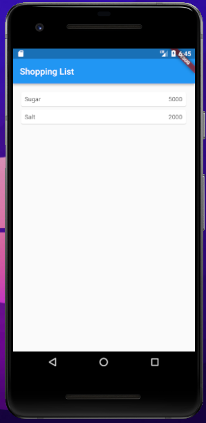
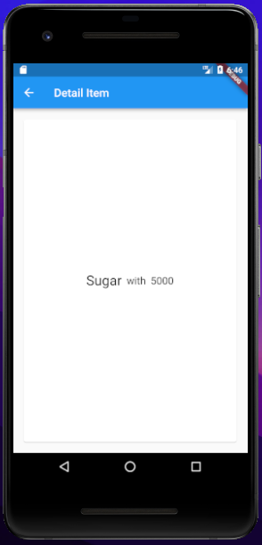
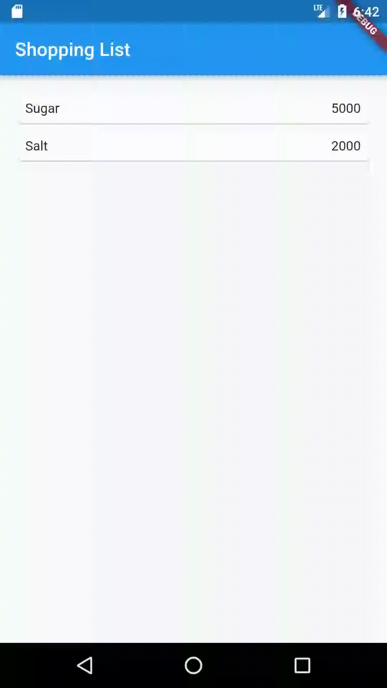
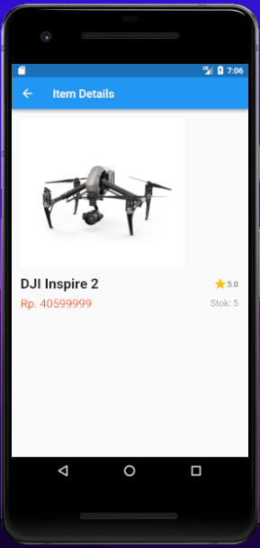

# **Laporan Praktikum**
# **Pertemuan 8**
### **Konsep Navigasi dan Route**
------


### **Data Mahasiswa**


><p>Nama : Alvian Nur Firdaus<p>
>NIM : 2141720022<p>
>Kelas : 3H<p>
>Prodi : D-IV Teknik Inormatika<p>
>Jurusan : Teknologi Inormasi<p>


<br>

### **Tujuan Praktikum**
Setelah menyelesaikan codelab ini Anda akan mampu untuk:

1. menerapkan jenis-jenis layout
2. menerapkan navigasi
3. menerapkan routing


<br>

---------
<br>

### **Praktikum 5: Membangun Navigasi di Flutter**
>Apa yang akan Anda pelajari<p>
>1. Cara kerja mekanisme navigation dan route di Flutter.
>2. Cara membuat navigation dan route di Flutter.
><p>

Selesaikan langkah-langkah praktikum berikut ini menggunakan editor Visual Studio Code (VS Code) atau Android Studio atau code editor lain kesukaan Anda. Materi ini dapat dimasukkan ke Laporan Praktikum folder Week atau Pertemuan 08.<p>

Pada praktikum 5 ini anda akan belajar mengenai pembangunan aplikasi bergerak multi halaman. Aplikasi yang dikembangkan berupa kasus daftar barang belanja. Pada aplikasi ini anda akan belajar untuk berpindah halaman dan mengirimkan data ke halaman lainnya. Gambaran mockup hasil akhir aplikasi dapat anda lihat pada gambar di atas (mockup dibuat sederhana, sehingga Anda mempunyai banyak ruang untuk berkreasi). Desain aplikasi menampilkan sebuah ListView widget yang datanya bersumber dari List. Ketika item ditekan, data akan dikirimkan ke halaman berikutnya.

### **Langkah 1 Siapkan project baru**
Sebelum melanjutkan praktikum, buatlah sebuah project baru Flutter dengan nama belanja dan susunan folder seperti pada gambar berikut. Penyusunan ini dimaksudkan untuk mengorganisasi kode dan widget yang lebih mudah.<p>

<p>

### **Langkah 2 Mendefinisikan Route**
Buatlah dua buah file dart dengan nama home_page.dart dan item_page.dart pada folder pages. Untuk masing-masing file, deklarasikan class HomePage pada file home_page.dart dan ItemPage pada item_page.dart. Turunkan class dari StatelessWidget. Gambaran potongan kode dapat anda lihat sebagai berikut..<p>

```dart
class ItemPage extends StatelessWidget {
  const ItemPage({super.key});
  @override
  Widget build(BuildContext context) {
```


### **Langkah 3 Lengkapi Kode di main.dart**
Setelah kedua halaman telah dibuat dan didefinisikan, bukalah file main.dart. Pada langkah ini anda akan mendefinisikan Route untuk kedua halaman tersebut. Definisi penamaan route harus bersifat unique. Halaman HomePage didefinisikan sebagai /. Dan halaman ItemPage didefinisikan sebagai /item. Untuk mendefinisikan halaman awal, anda dapat menggunakan named argument initialRoute. Gambaran tahapan ini, dapat anda lihat pada potongan kode berikut.

```dart
Widget build(BuildContext context) {
    return MaterialApp(
      initialRoute: '/',
      routes: {
        '/': (context) => HomePage(),
        '/item': (context) => const ItemPage(),
      },
    );
  }
}
```

### **Langkah 4 Membuat data model**
Sebelum melakukan perpindahan halaman dari HomePage ke ItemPage, dibutuhkan proses pemodelan data. Pada desain mockup, dibutuhkan dua informasi yaitu nama dan harga. Untuk menangani hal ini, buatlah sebuah file dengan nama item.dart dan letakkan pada folder models. Pada file ini didefinisikan pemodelan data yang dibutuhkan. Ilustrasi kode yang dibutuhkan, dapat anda lihat pada potongan kode berikut.

```dart
class Item {
  String? name;
  int? price;

  Item({this.name, this.price});
}
```

### **Langkah 5: Lengkapi kode di class HomePage**
Pada halaman HomePage terdapat ListView widget. Sumber data ListView diambil dari model List dari object Item. Gambaran kode yang dibutuhkan untuk melakukan definisi model dapat anda lihat sebagai berikut.

```dart
final List<Item> items = [
    Item(name: 'Sugar', price: 5000),
    Item(name: 'Salt', price: 2000),
  ];
```

### **Langkah 6: Membuat ListView dan itemBuilder**
Untuk menampilkan ListView pada praktikum ini digunakan itemBuilder. Data diambil dari definisi model yang telah dibuat sebelumnya. Untuk menunjukkan batas data satu dan berikutnya digunakan widget Card. Kode yang telah umum pada bagian ini tidak ditampilkan. Gambaran kode yang dibutuhkan dapat anda lihat sebagai berikut.

```dart
      body: Container(
        margin: const EdgeInsets.all(15),
        child: ListView.builder(
          itemCount: items.length,
          itemBuilder: (context, index) {
            final item = items[index];
            return Material(
              child: InkWell(
                onTap: () {
                  Navigator.pushNamed(context, routeName, arguments: item);
                },
                child: Card(
                  child: Container(
                    margin: const EdgeInsets.all(8),
                    child: Row(
                      children: [
                        Expanded(child: Text(item.name.toString())),
                        Expanded(
                          child: Text(
                            item.price.toString(),
                            textAlign: TextAlign.end,
                          ),
                        )
                      ],
                    ),
                  ),
                ),
              ),
            );
          },
        ),
      ),
```
Jalankan aplikasi pada emulator atau pada device anda.

>**Perhatian**<p>
>Perhatian: Pastikan pada halaman awal telah berhasil menampilkan ListView. Jika ada kesalahan, segera perbaiki sebelum melanjutkan ke langkah berikutnya.<p>

### **Langkah 7: Menambahkan aksi pada ListView**
Item pada ListView saat ini ketika ditekan masih belum memberikan aksi tertentu. Untuk menambahkan aksi pada ListView dapat digunakan widget InkWell atau GestureDetector. Perbedaan utamanya InkWell merupakan material widget yang memberikan efek ketika ditekan. Sedangkan GestureDetector bersifat umum dan bisa juga digunakan untuk gesture lain selain sentuhan. Pada praktikum ini akan digunakan widget InkWell.<p>

Untuk menambahkan sentuhan, letakkan cursor pada widget pembuka Card. Kemudian gunakan shortcut quick fix dari VSCode (Ctrl + . pada Windows atau Cmd + . pada MacOS). Sorot menu wrap with widget... Ubah nilai widget menjadi InkWell serta tambahkan named argument onTap yang berisi fungsi untuk berpindah ke halaman ItemPage. Ilustrasi potongan kode dapat anda lihat pada potongan berikut.

```dart
return InkWell(
    onTap: () {
        Navigator.pushNamed(context, '/item');
    }
)
```

Jalankan aplikasi kembali dan pastikan ListView dapat disentuh dan berpindah ke halaman berikutnya. Periksa kembali jika terdapat kesalahan.<p>

**Dan berikut hasil Output Praktikum saya 
<table>
  <tr>
    <th>Home page</th>
    <th>Item Page</th>
    <th>gambar output berupa gif</th>
  </tr>
  <tr>
    <th></th>
    <th></th>
    <th></th>
  </tr>
</table>

-----
<br>

### **Tugas Praktikum**
1. Untuk melakukan pengiriman data ke halaman berikutnya, cukup menambahkan informasi arguments pada penggunaan Navigator. Perbarui kode pada bagian Navigator menjadi seperti berikut.

```dart
Navigator.pushNamed(context, '/item', arguments: item);
```

2. Pembacaan nilai yang dikirimkan pada halaman sebelumnya dapat dilakukan menggunakan ModalRoute. Tambahkan kode berikut pada blok fungsi build dalam halaman ItemPage. Setelah nilai didapatkan, anda dapat menggunakannya seperti penggunaan variabel pada umumnya. (https://docs.flutter.dev/cookbook/navigation/navigate-with-arguments)

```dart
final itemArgs = ModalRoute.of(context)!.settings.arguments as Item;
```

3. Pada hasil akhir dari aplikasi belanja yang telah anda selesaikan, tambahkan atribut foto produk, stok, dan rating. Ubahlah tampilan menjadi GridView seperti di aplikasi marketplace pada umumnya.


4. Silakan implementasikan Hero widget pada aplikasi belanja Anda dengan mempelajari dari sumber ini: https://docs.flutter.dev/cookbook/navigation/hero-animations

5. Sesuaikan dan modifikasi tampilan sehingga menjadi aplikasi yang menarik. Selain itu, pecah widget menjadi kode yang lebih kecil. Tambahkan Nama dan NIM di footer aplikasi belanja Anda.

6. Selesaikan Praktikum Navigasi dan Rute tersebut, lalu dokumentasikan dan push ke repository Anda berupa screenshot setiap hasil pekerjaan beserta penjelasannya di file README.md. Kumpulkan link commit repository GitHub Anda ke spreadsheet yang telah disediakan!

### **Jawab**<p>

**Berikut adalah hasil output Tugas Praktikum saya hasil revisi menambahkan decomposition widget**


### **Models**
>File item.dart

```dart
class Item {
  String name, imageUrl;
  int price, stok;
  double rating;

  Item(
      {required this.name,
      required this.price,
      required this.imageUrl,
      required this.stok,
      required this.rating});
}
```

### **Pages**
>File home_page.dart

```dart
import 'package:belanja/models/item.dart';
import 'package:flutter/material.dart';
import 'package:belanja/widgets/card.dart';
import 'package:belanja/widgets/bottom_app_bar.dart';

class HomePage extends StatelessWidget {
  final List<Item> items = [
    Item(
        name: 'DJI Mini 2 SE',
        price: 5690000,
        imageUrl: 'assets/dji.PNG',
        stok: 5,
        rating: 4.6),
    Item(
        name: 'DJI Inspire 2',
        price: 40599999,
        imageUrl: 'assets/dji_inspire2.PNG',
        stok: 5,
        rating: 5),
    Item(
        name: 'Sony HXR MC88',
        price: 21999000,
        imageUrl: 'assets/sony_mc88.PNG',
        stok: 5,
        rating: 4.5),
    Item(
        name: 'Sony HXR NX100',
        price: 19500000,
        imageUrl: 'assets/sony_nx100.PNG',
        stok: 10,
        rating: 4.7),
    Item(
        name: 'Atem Mini Pro',
        price: 5000000,
        imageUrl: 'assets/atem.PNG',
        stok: 2,
        rating: 4.9),
  ];

  @override
  Widget build(BuildContext context) {
    return Scaffold(
        appBar: AppBar(
          title: const Text('Sunrise Camera & Gadgets'),
        ),
        body: GridView.builder(
          gridDelegate: const SliverGridDelegateWithFixedCrossAxisCount(
            crossAxisCount: 2, // Menampilkan 2 item per baris
            childAspectRatio: 0.7, // Mengatur rasio lebar-tinggi item
          ),
          itemCount: items.length,
          itemBuilder: (context, index) {
            final item = items[index];
            return AlvianCard(
                item: item,
                onTap: () =>
                    Navigator.pushNamed(context, '/item', arguments: item));
          },
        ),
        bottomNavigationBar: AlvianBottomAppBar());
  }
}

```

>file item_page.dart

```dart
import 'package:belanja/models/item.dart';
import 'package:flutter/material.dart';

class ItemPage extends StatelessWidget {
  const ItemPage({super.key});

  @override
  Widget build(BuildContext context) {
    final itemArgs = ModalRoute.of(context)!.settings.arguments as Item;

    return Scaffold(
      appBar: AppBar(
        title: const Text('Item Details'),
      ),
      body: Padding(
        padding: const EdgeInsets.all(16.0),
        child: Column(
          crossAxisAlignment: CrossAxisAlignment.start,
          children: [
            Hero(
              tag: 'productImage${itemArgs.name}',
              child: Image.asset(itemArgs.imageUrl),
            ),
            const SizedBox(
                height: 16), // Tambahkan jarak antara gambar dan teks
            Row(
              mainAxisAlignment: MainAxisAlignment.spaceBetween,
              children: [
                Text(
                  '${itemArgs.name}',
                  style: const TextStyle(
                    fontWeight: FontWeight.bold,
                    fontSize: 24,
                  ),
                ),
                Row(
                  children: [
                    const Icon(Icons.star, color: Colors.amber),
                    Text(
                      itemArgs.rating.toString(),
                    ),
                  ],
                ),
              ],
            ),
            const SizedBox(height: 8), // Tambahkan jarak antara nama dan harga
            Row(
              mainAxisAlignment: MainAxisAlignment.spaceBetween,
              children: [
                Text(
                  'Rp. ${itemArgs.price}',
                  style: const TextStyle(
                    color: Colors.deepOrange,
                    fontSize: 20,
                  ),
                ),
                Text(
                  'Stok: ${itemArgs.stok}',
                  style: const TextStyle(
                    color: Colors.grey,
                    fontSize: 16,
                  ),
                ),
              ],
            ),
          ],
        ),
      ),
    );
  }
}
```

### **widgets**
> file bottom_app_bar.dart

```dart
import 'package:flutter/material.dart';

class AlvianBottomAppBar extends StatelessWidget {
  const AlvianBottomAppBar({super.key});

  @override
  Widget build(BuildContext context) {
    return BottomAppBar(
      child: Container(
        padding: const EdgeInsets.all(16),
        decoration: const BoxDecoration(
          color: Colors.blue,
        ),
        child: const Row(
          mainAxisAlignment: MainAxisAlignment.spaceBetween,
          children: [
            Text(
              'Nama: Alvian Nur Firdaus',
              style: TextStyle(
                color: Colors.white,
                fontSize: 16,
              ),
            ),
            Text(
              'NIM: 2141720022',
              style: TextStyle(
                color: Colors.white,
                fontSize: 16,
              ),
            ),
          ],
        ),
      ),
    );
  }
}
```

> file card.dart 

```dart
import 'package:belanja/models/item.dart';
import 'package:flutter/material.dart';

class AlvianCard extends StatelessWidget {
  void Function() onTap;
  final Item item;
  AlvianCard({super.key, required this.item, required this.onTap});

  @override
  Widget build(BuildContext context) {
    return InkWell(
      onTap: () {
        Navigator.pushNamed(context, '/item', arguments: item);
      },
      child: Card(
        child: Padding(
          padding: const EdgeInsets.all(
              8), // Tambahkan padding pada keseluruhan Card
          child: Column(
            crossAxisAlignment: CrossAxisAlignment.start,
            children: [
              Hero(
                tag: 'productImage${item.name}',
                child: AspectRatio(
                  aspectRatio:
                      1, // Rasio lebar-tinggi 1:1 untuk ukuran yang sama
                  child: Image.asset(item.imageUrl, fit: BoxFit.fitWidth),
                ),
              ),
              Row(
                mainAxisAlignment: MainAxisAlignment
                    .spaceBetween, // Agar rating berada di sebelah kanan
                children: [
                  Padding(
                    padding: const EdgeInsets.only(
                        top: 8), // Padding di atas teks "name"
                    child: Text(
                      item.name,
                      style: const TextStyle(
                        fontWeight: FontWeight.bold,
                        fontSize: 12,
                      ),
                    ),
                  ),
                  Row(
                    children: [
                      const Icon(Icons.star, color: Colors.amber),
                      Text(
                        item.rating.toString(),
                        style: const TextStyle(
                          color: Colors.amber,
                          fontSize: 14,
                        ),
                      ),
                    ],
                  ),
                ],
              ),
              Padding(
                padding: const EdgeInsets.symmetric(vertical: 8),
                child: Text(
                  'Rp. ${item.price}',
                  style: const TextStyle(
                    color: Colors.deepOrange,
                    fontSize: 14,
                  ),
                ),
              ),
              Text(
                'Stok: ${item.stok}',
                style: const TextStyle(
                  color: Colors.grey,
                  fontSize: 14,
                ),
              ),
            ],
          ),
        ),
      ),
    );
  }
}
```


  <table>
  <tr>
    <th>Home page</th>
    <th>Item Page</th>
    <th>gambar output berupa gif</th>
  </tr>
  <tr>
    <th></th>
    <th></th>
    <th></th>
  </tr>
</table>


>**Link Repository**<p>
>[Berikut Link Repository saya (klik)](https://github.com/alvianfirdaus/2141720022-mobile-2023/tree/main/week-08)<p>


