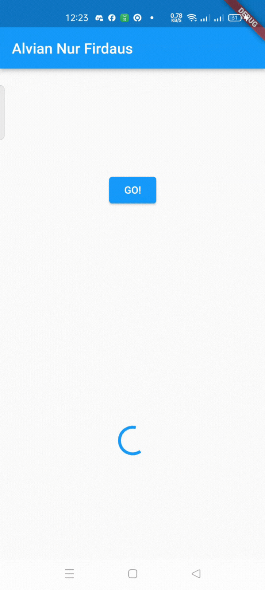

# **Laporan Praktikum**
# **Pertemuan 12**
### **Dasar State Management**
------


### **Data Mahasiswa**


><p>Nama : Alvian Nur Firdaus<p>
>NIM : 2141720022<p>
>Kelas : 3H<p>
>Prodi : D-IV Teknik Inormatika<p>
>Jurusan : Teknologi Inormasi<p>


<br>

### **Tujuan Praktikum**
Setelah menyelesaikan codelab ini Anda akan mampu untuk:

1. menjelaskan konsep arsitektur model-view
2. mengelola data layer dengan InheritedWidget dan InheritedNotifier
3. membuat app state di multiple screens


### **Daftar Isi**

<br>

---------
<br>

### **Praktikum 1: Mengunduh Data dari Web Service (API)**
Selesaikan langkah-langkah praktikum berikut ini menggunakan editor Visual Studio Code (VS Code) atau Android Studio atau code editor lain kesukaan Anda. Jawablah di laporan praktikum Anda pada setiap soal yang ada di beberapa langkah praktikum ini.<p>

>**Perhatian:** Diasumsikan Anda telah berhasil melakukan setup environment Flutter SDK, VS Code, Flutter Plugin, dan Android SDK pada pertemuan pertama.

### **Langkah 1: Buat Project Baru**
Buatlah sebuah project flutter baru dengan nama books di folder src week-12 repository GitHub Anda.<p>

Kemudian Tambahkan dependensi http dengan mengetik perintah berikut di terminal.<p>

```dart
flutter pub add http
```

### **Langkah 2: Cek file pubspec.yaml**
Jika berhasil install plugin, pastikan plugin http telah ada di file pubspec ini seperti berikut.

```dart
dependencies:
  flutter:
    sdk: flutter
  http: ^1.1.0
```

**Jika Anda menggunakan macOS**, Anda harus mengaktifkan fitur networking pada file macos/Runner/DebugProfile.entitlements dan macos/Runner/Release.entitlements dengan menambahkan kode berikut:

<p>

### **Langkah 3: Buka file main.dart**
Ketiklah kode seperti berikut ini.

>Soal 1<p>
>Tambahkan nama panggilan Anda pada title app sebagai identitas hasil pekerjaan Anda.

```dart
import 'package:flutter/material.dart';
import 'dart:async';
import 'package:http/http.dart';
import 'package:http/http.dart' as http;

void main() {
  runApp(const MyApp());
}

class MyApp extends StatelessWidget {
  const MyApp({super.key});

  // This widget is the root of your application.
  @override
  Widget build(BuildContext context) {
    return MaterialApp(
      title: 'Flutter Demo',
      theme: ThemeData(
        primarySwatch: Colors.blue,
        visualDensity: VisualDensity.adaptivePlatformDensity,
      ),
      home: const FuturePage(),
    );
  }
}

class FuturePage extends StatefulWidget {
  const FuturePage({super.key});

  @override
  State<FuturePage> createState() => _FuturePageState();
}

class _FuturePageState extends State<FuturePage> {
  String result = '';

  @override
  Widget build(BuildContext context) {
    return Scaffold(
      appBar: AppBar(
        title: const Text('Alvian Nur Firdaus'),
      ),
      body: Center(
        child: Column(children: [
          const Spacer(),
          ElevatedButton(
            child: const Text('GO!'),
            onPressed: () {},
          ),
          const Spacer(),
          Text(result),
          const Spacer(),
          const CircularProgressIndicator(),
          const Spacer(),
        ]),
      ),
    );
  }
}
```

>Catatan:<p>
>Tidak ada yang spesial dengan kode di main.dart tersebut. Perlu diperhatikan di kode tersebut terdapat widget CircularProgressIndicator yang akan menampilkan animasi berputar secara terus-menerus, itu pertanda bagus bahwa aplikasi Anda responsif (tidak freeze/lag). Ketika animasi terlihat berhenti, itu berarti UI menunggu proses lain sampai selesai.

### **Langkah 4: Tambah method getData()**
Tambahkan method ini ke dalam class _FuturePageState yang berguna untuk mengambil data dari API Google Books.

```dart
Future<Response> getData() async {
    const authority = 'www.googleapis.com';
    const path = '/books/v1/volumes/VX0crY5PkFYC';
    Uri url = Uri.https(authority, path);
    return http.get(url);
}
```

>Soal 2<p>
>- Carilah judul buku favorit Anda di Google Books, lalu ganti ID buku pada variabel path di kode tersebut. Caranya ambil di URL browser Anda seperti gambar berikut ini.
> - Kemudian cobalah akses di browser URI tersebut dengan lengkap seperti ini. Jika menampilkan data JSON, maka Anda telah berhasil. Lakukan capture milik Anda dan tulis di README pada laporan praktikum. Lalu lakukan commit dengan pesan "W12: Soal 2".
><p>

### **Langkah 5: Tambah kode di ElevatedButton**
Tambahkan kode pada onPressed di ElevatedButton seperti berikut.

```dart
ElevatedButton(
            child: const Text('GO!'),
            onPressed: () {
              setState(() {});
              getData().then((value) {
                result = value.body.toString().substring(0, 450);
                setState(() {});
              }).catchError((_) {
                result = 'An error occurred';
                setState(() {});
              });
            },
          ),
```

Lakukan run aplikasi Flutter Anda. Anda akan melihat tampilan akhir seperti gambar berikut. Jika masih terdapat error, silakan diperbaiki hingga bisa running.


>Soal 3<p>
>Jelaskan maksud kode langkah 5 tersebut terkait substring dan catchError!
Capture hasil praktikum Anda berupa GIF dan lampirkan di README. Lalu lakukan commit dengan pesan "W12: Soal 3".

>**Jawab**
>substring() adalah metode untuk mengambil substring dari string. Substring adalah bagian dari string yang dimulai dari indeks tertentu dan berakhir pada indeks tertentu. Metode substring() menerima dua parameter, yaitu indeks awal dan indeks akhir. Indeks awal adalah indeks karakter pertama yang ingin diambil, dan indeks akhir adalah indeks karakter terakhir yang ingin diambil. catchError() adalah metode untuk menangani kesalahan. Metode catchError() menerima satu parameter, yaitu fungsi yang akan dijalankan jika terjadi kesalahan. Fungsi tersebut akan menerima objek kesalahan sebagai parameter. Kode di atas menggunakan substring() untuk mengambil 450 karakter pertama dari respons API. Jika terjadi kesalahan saat mengambil respons API, maka kode tersebut akan menggunakan catchError() untuk menampilkan pesan kesalahan "An error occurred".

<table>
    <tr>
        <th></th>
        <th></th>
    </tr>
</table>

<br>

-------------


<br>

### **Praktikum 2: Menggunakan await/async untuk menghindari callbacks**
Ada alternatif penggunaan Future yang lebih clean, mudah dibaca dan dirawat, yaitu pola async/await. Intinya pada dua kata kunci ini:
- async digunakan untuk menandai suatu method sebagai asynchronous dan itu harus ditambahkan di depan kode function.
- await digunakan untuk memerintahkan menunggu sampai eksekusi suatu function itu selesai dan mengembalikan sebuah value. Untuk then bisa digunakan pada jenis method apapun, sedangkan await hanya bekerja di dalam method async.

Berikut ini contoh kode perbedaan Future dengan then dan async/await.<p>

<p>

Setelah Anda menyelesaikan praktikum 1, Anda dapat melanjutkan praktikum 2 ini. Selesaikan langkah-langkah praktikum berikut ini menggunakan editor Visual Studio Code (VS Code) atau Android Studio atau code editor lain kesukaan Anda. Jawablah di laporan praktikum Anda pada setiap soal yang ada di beberapa langkah praktikum ini.

>**Perhatian:** Diasumsikan Anda telah berhasil menyelesaikan Praktikum 1.<p>

Pada codelab ini, kita akan menambah kode dari aplikasi books di praktikum sebelumnya.

### **Langkah 1: Buka file main.dart**
Tambahkan tiga method berisi kode seperti berikut di dalam class _FuturePageState.

```dart
Future<int> returnOneAsync() async {
  await Future.delayed(const Duration(seconds: 3));
  return 1;
}

Future<int> returnTwoAsync() async {
  await Future.delayed(const Duration(seconds: 3));
  return 2;
}

Future<int> returnThreeAsync() async {
  await Future.delayed(const Duration(seconds: 3));
  return 3;
}
```

### **Langkah 2: Tambah method count()**
Lalu tambahkan lagi method ini di bawah ketiga method sebelumnya.

```dart
Future count() async {
    int total = 0;
    total = await returnOneAsync();
    total += await returnTwoAsync();
    total += await returnThreeAsync();
    setState(() {
      result = total.toString();
    });
  }
```

### **Langkah 3: Panggil count()**
Lakukan comment kode sebelumnya, ubah isi kode onPressed() menjadi seperti berikut.

```dart
ElevatedButton(
            child: Text('GO!'),
            onPressed: () {
              count();
            }
)
```

### **Langkah 4: Run**
Akhirnya, run atau tekan F5 jika aplikasi belum running. Maka Anda akan melihat seperti gambar berikut, hasil angka 6 akan tampil setelah delay 9 detik.

>Soal 4<p>
>Jelaskan maksud kode langkah 1 dan 2 tersebut!<p>
>Capture hasil praktikum Anda berupa GIF dan lampirkan di README. Lalu lakukan commit dengan pesan "W12: Soal 4".<p>

>**Jawab**
>Langkah 1 Kode di atas adalah kode Dart yang terdiri dari tiga fungsi asynchronous, yaitu returnOneAsync(), returnTwoAsync(), dan returnThreeAsync(). Ketiga fungsi ini mengembalikan nilai int dan menggunakan Future.delayed() untuk menunda eksekusi selama 3 detik. Berikut adalah penjelasan masing-masing fungsi:
>
>- returnOneAsync() Fungsi ini mengembalikan nilai 1 setelah 3 detik.
>- returnTwoAsync() Fungsi ini mengembalikan nilai 2 setelah 3 detik.
>- returnThreeAsync() Fungsi ini mengembalikan nilai 3 setelah 3 detik.
>Langkah 2 Kode di atas adalah sebuah fungsi asynchronous bernama count() yang digunakan untuk menghitung jumlah dari tiga fungsi asynchronous lainnya, yaitu returnOneAsync(), returnTwoAsync(), dan returnThreeAsync(). Fungsi count() ini mengembalikan Future, yang berarti bahwa eksekusinya tidak akan memblokir kode lainnya.

<table>
    <tr>
        <th></th>
        <th></th>
    </tr>
</table>

<br>

------

<br>

### **Praktikum 3: Menggunakan Completer di Future**
Menggunakan Future dengan then, catchError, async, dan await mungkin sudah cukup untuk banyak kasus, tetapi ada alternatif melakukan operasi async di Dart dan Flutter yaitu dengan class Completer.<p>

Completer membuat object Future yang mana Anda dapat menyelesaikannya nanti (late) dengan return sebuah value atau error.<p>

Setelah Anda menyelesaikan praktikum 2, Anda dapat melanjutkan praktikum 3 ini. Selesaikan langkah-langkah praktikum berikut ini menggunakan editor Visual Studio Code (VS Code) atau Android Studio atau code editor lain kesukaan Anda. Jawablah di laporan praktikum Anda pada setiap soal yang ada di beberapa langkah praktikum ini.<p>

>**Perhatian: Diasumsikan Anda telah berhasil menyelesaikan Praktikum 2.**

### **Langkah 1: Buka main.dart**
Pastikan telah impor package async berikut.

```dart
import 'package:async/async.dart';
```

### **Langkah 2: Tambahkan variabel dan method**
Tambahkan variabel late dan method di class _FuturePageState seperti ini.

```dart
late Completer completer;

Future getNumber() {
  completer = Completer<int>();
  calculate();
  return completer.future;
}

Future calculate() async {
  await Future.delayed(const Duration(seconds : 5));
  completer.complete(42);
}
```

### **Langkah 3: Ganti isi kode onPressed()**
Tambahkan kode berikut pada fungsi onPressed(). Kode sebelumnya bisa Anda comment.

```dart
getNumber().then((value) {
                setState(() {
                  result = value.toString();
                });
              });
```

### **Langkah 4:**
Terakhir, run atau tekan F5 untuk melihat hasilnya jika memang belum running. Bisa juga lakukan hot restart jika aplikasi sudah running. Maka hasilnya akan seperti gambar berikut ini. Setelah 5 detik, maka angka 42 akan tampil.

>Soal 5<p>
>Jelaskan maksud kode langkah 2 tersebut!<p>
>Capture hasil praktikum Anda berupa GIF dan lampirkan di README. Lalu lakukan commit dengan pesan "W12: Soal 5".<p>

>**Jawab**
>Pada langkah 2, kita menambahkan variabel completer dan method getNumber() dan calculate() di class _FuturePageState.
>
>1. Variabel completer Variabel completer adalah variabel late dari tipe Completer. Variabel ini digunakan untuk menyimpan hasil dari perhitungan angka 42.
> 2. Method getNumber() Method getNumber() mengembalikan nilai dari variabel completer. Method ini memiliki dua langkah: a. Inisialisasi variabel completer dengan nilai baru. b. Memanggil method calculate() untuk menghitung angka 42.
>3. Method calculate() Method calculate() menggunakan Future.delayed() untuk menunggu 5 detik sebelum menyelesaikan perhitungan angka 42. Setelah 5 detik, method ini akan memanggil method completer.complete() untuk menyelesaikan perhitungan dan mengembalikan nilai 42 ke variabel completer

<table>
    <tr>
        <th></th>
        <th></th>
    </tr>
</table>

### **Langkah 5: Ganti method calculate()**
Gantilah isi code method calculate() seperti kode berikut, atau Anda dapat membuat calculate2()

```dart
calculate2() async {
    try {
      await new Future.delayed(const Duration(seconds: 5));
      completer.complete(42);
    } catch (_) {
      completer.completeError({});
    }
  }
```

### **Langkah 6: Pindah ke onPressed()
Ganti menjadi kode seperti berikut.**

```dart
getNumber().then((value) {
  setState(() {
    result = value.toString();
  });
}).catchError((e) {
  result = 'An error occurred';
});
```

>Soal 6<p>
>Jelaskan maksud perbedaan kode langkah 2 dengan langkah 5-6 tersebut!<p>
>Capture hasil praktikum Anda berupa GIF dan lampirkan di README. Lalu lakukan commit dengan pesan "W12: Soal 6".<p>

>**Jawab**
>Langkah 5 Pada langkah 5, kita mengganti isi dari method calculate(). Method calculate() sebelumnya menggunakan await Future.delayed(const Duration(seconds: 5)); untuk menunggu 5 detik sebelum menyelesaikan perhitungan angka 42. Namun, method ini tidak menangani kesalahan yang mungkin terjadi saat menunggu 5 detik. Kode ini menggunakan try/catch untuk menangani kesalahan yang mungkin terjadi saat menunggu 5 detik. Jika tidak terjadi kesalahan, maka method ini akan memanggil method completer.complete() untuk menyelesaikan perhitungan dan mengembalikan nilai 42 ke variabel completer. Jika terjadi kesalahan, maka method ini akan memanggil method completer.completeError() untuk menyelesaikan perhitungan dan mengembalikan nilai {} ke variabel completer.
>
>Langkah 6 Pada langkah 6, kita mengganti kode di method onPressed(). Method onPressed() sebelumnya menggunakan then() untuk menangani hasil dari method getNumber(). Namun, method ini tidak menangani kesalahan yang mungkin terjadi saat memanggil method getNumber(). Kode ini menggunakan then() dan catchError() untuk menangani hasil dari method getNumber(). Jika tidak terjadi kesalahan, maka method ini akan memanggil method setState() untuk memperbarui state dari widget. Jika terjadi kesalahan, maka method ini akan memanggil method setState() untuk memperbarui state dari widget dan menampilkan pesan kesalahan.

<table>
    <tr>
        <th></th>
        <th></th>
    </tr>
</table>

<br>

-----------------

<br>

### **Praktikum 4: Memanggil Future secara paralel**
Ketika Anda membutuhkan untuk menjalankan banyak Future secara bersamaan, ada sebuah class yang dapat Anda gunakan yaitu: FutureGroup.<p>

FutureGroup tersedia di package async, yang mana itu harus diimpor ke file dart Anda, seperti berikut.

```dart
import 'package:async/async.dart';
```

>**Catatan:** Package dart:async dan async/async.dart merupakan library yang berbeda. Pada beberapa kasus, Anda membutuhkan kedua lib tersebut untuk me-run code async.<p>

FutureGroup adalah sekumpulan dari Future yang dapat run secara paralel. Ketika run secara paralel, maka konsumsi waktu menjadi lebih hemat (cepat) dibanding run method async secara single setelah itu method async lainnya.<p>

Ketika semua code async paralel selesai dieksekusi, maka FutureGroup akan return value sebagai sebuah List, sama juga ketika ingin menambahkan operasi paralel dalam bentuk List.<p>

Setelah Anda menyelesaikan praktikum 3, Anda dapat melanjutkan praktikum 4 ini. Selesaikan langkah-langkah praktikum berikut ini menggunakan editor Visual Studio Code (VS Code) atau Android Studio atau code editor lain kesukaan Anda. Jawablah di laporan praktikum Anda pada setiap soal yang ada di beberapa langkah praktikum ini.<p>

>**Perhatian:** Diasumsikan Anda telah berhasil menyelesaikan Praktikum 3.

### **Langkah 1: Buka file main.dart**
Tambahkan method ini ke dalam class _FuturePageState

```dart
void returnFG() {
    FutureGroup<int> futureGroup = FutureGroup<int>();
    futureGroup.add(returnOneAsync());
    futureGroup.add(returnTwoAsync());
    futureGroup.add(returnThreeAsync());
    futureGroup.close();
    futureGroup.future.then((List<int> value) {
      int total = 0;
      for (var element in value) {
        total += element;
      }
      setState(() {
        result = total.toString();
      });
    });
  }
```

### **Langkah 2: Edit onPressed()**
Anda bisa hapus atau comment kode sebelumnya, kemudian panggil method dari langkah 1 tersebut.

```dart
onPressed: () {
              returnFG();
}
```

### **Langkah 3: Run**
Anda akan melihat hasilnya dalam 3 detik berupa angka 6 lebih cepat dibandingkan praktikum sebelumnya menunggu sampai 9 detik.<p>

>Soal 7<p>
>Capture hasil praktikum Anda berupa GIF dan lampirkan di README. Lalu lakukan commit dengan pesan "W12: Soal 7".<p>

<table>
    <tr>
        <th></th>
        <th></th>
    </tr>
</table>

### **Langkah 4: Ganti variabel futureGroup**
Anda dapat menggunakan FutureGroup dengan Future.wait seperti kode berikut.

```dart
final futures = Future.wait<int>([
  returnOneAsync(),
  returnTwoAsync(),
  returnThreeAsync(),
]);
```

>Soal 8<p>
>Jelaskan maksud perbedaan kode langkah 1 dan 4!

>**Jawab** Perbedaan kode langkah 1 dan kode langkah 4 adalah pada penggunaan variabel futureGroup. Pada langkah 1, variabel futureGroup digunakan untuk menampung FutureGroup. FutureGroup adalah sebuah objek yang dapat digunakan untuk mengelompokkan beberapa Future bersama-sama. Sedangkan pada langkah 4, variabel futureGroup diganti dengan Future.wait(). Future.wait() adalah sebuah fungsi yang dapat digunakan untuk menunggu beberapa Future selesai dijalankan.

<br>

-----

<br>

### **Praktikum 5: Menangani Respon Error pada Async Code**
Ada beberapa teknik untuk melakukan handle error pada code async. Pada praktikum ini Anda akan menggunakan 2 cara, yaitu then() callback dan pola async/await.<p>

Setelah Anda menyelesaikan praktikum 4, Anda dapat melanjutkan praktikum 5 ini. Selesaikan langkah-langkah praktikum berikut ini menggunakan editor Visual Studio Code (VS Code) atau Android Studio atau code editor lain kesukaan Anda. Jawablah di laporan praktikum Anda pada setiap soal yang ada di beberapa langkah praktikum ini.<p>

>**Perhatian:** Diasumsikan Anda telah berhasil menyelesaikan Praktikum 4.<p>

### **Langkah 1: Buka file main.dart**
Tambahkan method ini ke dalam class _FuturePageState

```dart
Future returnError() async {
    await Future.delayed(const Duration(seconds: 2));
    throw Exception('Something terrible happened!');
  }
```

### **Langkah 2: ElevatedButton**
Ganti dengan kode berikut

```dart
returnError().then((value) {
                setState(() {
                  result = 'Success';
                });
              }).catchError((onError) {
                setState(() {
                  result = onError.toString();
                });
              }).whenComplete(() => print('Complete'));
```

### **Langkah 3: Run**
Lakukan run dan klik tombol GO! maka akan menghasilkan seperti gambar berikut.

Pada bagian debug console akan melihat teks Complete seperti berikut.<p>

>Soal 9<p>
>Capture hasil praktikum Anda berupa GIF dan lampirkan di README. Lalu lakukan commit dengan pesan "W12: Soal 9".

<table>
    <tr>
        <th></th>
        <th></th>
    </tr>
</table>


### **Langkah 4: Tambah method handleError()**
Tambahkan kode ini di dalam class _FutureStatePage

```dart
Future handleError() async {
    try {
      await returnError();
    } catch (error) {
      setState(() {
        result = error.toString();
      });
    } finally {
      print('Complete');
    }
  }
```

>Soal 10<p>
>Panggil method handleError() tersebut di ElevatedButton, lalu run. Apa hasilnya? Jelaskan perbedaan kode langkah 1 dan 4!

>**Jawab** Perbedaan kode langkah 1 dan kode langkah 4 adalah pada penanganan error. Pada langkah 1, method returnError() tidak menangani error yang terjadi. Jika error terjadi, maka method tersebut akan berhenti dan tidak mengembalikan nilai apa pun.
>
>Sedangkan pada langkah 4, method handleError() menangani error yang terjadi dengan menggunakan try-catch-finally. Pada try block, method handleError() mencoba untuk menjalankan method returnError(). Jika error terjadi, maka try block akan berhenti dan error akan ditangkap oleh catch block. Pada catch block, method handleError() akan menampilkan error ke layar menggunakan print(). Finally block akan selalu dijalankan, terlepas dari apakah ada error yang terjadi atau tidak.

<br>

----

<br>

### **Praktikum 6: Menggunakan Future dengan StatefulWidget**
Seperti yang Anda telah pelajari, Stateless widget tidak dapat menyimpan informasi (state), StatefulWidget dapat mengelola variabel dan properti dengan method setState(), yang kemudian dapat ditampilkan pada UI. State adalah informasi yang dapat berubah selama life cycle widget itu berlangsung.<p>

Ada 4 method utama dalam life cycle StatefullWidget:
- initState(): dipanggil sekali ketika state dibangun. Bisa dikatakan ini juga sebagai konstruktor class.
- build(): dipanggil setiap kali ada perubahan state atau UI. Method ini melakukan destroy UI dan membangun ulang dari nol.
- deactive() dan dispose(): digunakan untuk menghapus widget dari tree, pada beberapa kasus dimanfaatkan untuk menutup koneksi ke database atau menyimpan data sebelum berpindah screen.

Setelah Anda menyelesaikan praktikum 5, Anda dapat melanjutkan praktikum 6 ini. Selesaikan langkah-langkah praktikum berikut ini menggunakan editor Visual Studio Code (VS Code) atau Android Studio atau code editor lain kesukaan Anda. Jawablah di laporan praktikum Anda pada setiap soal yang ada di beberapa langkah praktikum ini.

>**Perhatian:** Diasumsikan Anda telah berhasil menyelesaikan Praktikum 5.

### **Langkah 1: install plugin geolocator**
Tambahkan plugin geolocator dengan mengetik perintah berikut di terminal.

```dart
flutter pub add geolocator
```

### **Langkah 2: Tambah permission GPS**
Jika Anda menargetkan untuk platform Android, maka tambahkan baris kode berikut di file android/app/src/main/androidmanifest.xml

```dart
<uses-permission android:name="android.permission.ACCESS_FINE_LOCATION"/>
<uses-permission android:name="android.permission.ACCESS_COARSE_LOCATION"/>
```

Jika Anda menargetkan untuk platform iOS, maka tambahkan kode ini ke file Info.plist

```dart
<key>NSLocationWhenInUseUsageDescription</key>
<string>This app needs to access your location</string>
```

### **Langkah 3: Buat file geolocation.dart**
Tambahkan file baru ini di folder lib project Anda.

### **Langkah 4: Buat StatefulWidget**
Buat class LocationScreen di dalam file geolocation.dart

### **Langkah 5: Isi kode geolocation.dart**

```dart
import 'package:flutter/material.dart';
import 'package:geolocator/geolocator.dart';

class LocationScreen extends StatefulWidget {
  const LocationScreen({super.key});

  @override
  State<LocationScreen> createState() => _LocationScreenState();
}

class _LocationScreenState extends State<LocationScreen> {
  String myPosition = '';
  Future<Position>? position;

  @override
  void initState() {
    super.initState();
    position = getPosition();
  }

  @override
  Widget build(BuildContext context) {
    // final myWidget =
    //     myPosition == '' ? const CircularProgressIndicator() : Text(myPosition);
    // ;
    return Scaffold(
      appBar: AppBar(title: const Text('Current Location Lukas')),
      body: Center(
          child: FutureBuilder(
        future: position,
        builder: (BuildContext context, AsyncSnapshot<Position> snapshot) {
          if (snapshot.connectionState == ConnectionState.waiting) {
            return const CircularProgressIndicator();
          } else if (snapshot.connectionState == ConnectionState.done) {
            if (snapshot.hasError) {
              return Text('Something terrible happened!');
            }
            return Text(snapshot.data.toString());
          } else {
            return const Text('');
          }
        },
      )),
    );
  }

  Future<Position> getPosition() async {
    // await Geolocator.requestPermission();
    await Geolocator.isLocationServiceEnabled();
    await Future.delayed(const Duration(seconds: 3));
    Position position = await Geolocator.getCurrentPosition();
    return position;
  }
}
```

>Soal 11<p>
>Tambahkan nama panggilan Anda pada tiap properti title sebagai identitas pekerjaan Anda.

>**Jawab** appBar: AppBar(title: const Text('Current Location Alvian')),

### **Langkah 6: Edit main.dart**
Panggil screen baru tersebut di file main Anda seperti berikut.

```dart
home: LocationScreen(),
```

### **Langkah 7: Run**
Run project Anda di device atau emulator (bukan browser), maka akan tampil seperti berikut ini.

### **Langkah 8: Tambahkan animasi loading**
Tambahkan widget loading seperti kode berikut. Lalu hot restart, perhatikan perubahannya.

```dart
 @override
  Widget build(BuildContext context) {
    final myWidget =
    myPosition == '' ? const CircularProgressIndicator() : Text(myPosition);
    ;
    return Scaffold(
      appBar: AppBar(title: const Text('Current Location Alvian')),
      body: Center
          child: FutureBuilder(child:myWidget),
      );
  },
```

>Soal 12<p>
>Jika Anda tidak melihat animasi loading tampil, kemungkinan itu berjalan sangat cepat. Tambahkan delay pada method getPosition() dengan kode await Future.delayed(const Duration(seconds: 3));<p>
>Apakah Anda mendapatkan koordinat GPS ketika run di browser? Mengapa demikian?
>Capture hasil praktikum Anda berupa GIF dan lampirkan di README. Lalu lakukan commit dengan pesan "W12: Soal 12".<p>

>**Jawab** Karena package geolocator juga support di browser, sehingga koordinat GPS juga bisa didapatkan pada browser, beserta izinnya.

<table>
    <tr>
        <th></th>
        <th></th>
        <th></th>
    </tr>
</table>

<br>

----

<br>

### **Praktikum 7: Manajemen Future dengan FutureBuilder**
Pola ketika menerima beberapa data secara async dan melakukan update pada UI sebenarnya itu tergantung pada ketersediaan data. Secara umum fakta di Flutter, ada sebuah widget yang membantu Anda untuk memudahkan manajemen future yaitu widget FutureBuilder.<p>

Anda dapat menggunakan FutureBuilder untuk manajemen future bersamaan dengan update UI ketika ada update Future. FutureBuilder memiliki status future sendiri, sehingga Anda dapat mengabaikan penggunaan setState, Flutter akan membangun ulang bagian UI ketika update itu dibutuhkan.<p>

Untuk lebih memahami widget FutureBuilder, mari kita coba dengan praktikum ini.<p>

Setelah Anda menyelesaikan praktikum 6, Anda dapat melanjutkan praktikum 7 ini. Selesaikan langkah-langkah praktikum berikut ini menggunakan editor Visual Studio Code (VS Code) atau Android Studio atau code editor lain kesukaan Anda. Jawablah di laporan praktikum Anda pada setiap soal yang ada di beberapa langkah praktikum ini.<p>

>**Perhatian:** Diasumsikan Anda telah berhasil menyelesaikan Praktikum 6.

### **Langkah 1: Modifikasi method getPosition()**
Buka file geolocation.dart kemudian ganti isi method dengan kode ini.

```dart
Future<Position> getPosition() async {
    await Geolocator.requestPermission();
    await Geolocator.isLocationServiceEnabled();
    await Future.delayed(const Duration(seconds: 3));
    Position position = await Geolocator.getCurrentPosition();
    return position; }
```

### **Langkah 2: Tambah variabel**
Tambah variabel ini di class _LocationScreenState

```dart
Future<Position>? position;
```

### **Langkah 3: Tambah initState()**
Tambah method ini dan set variabel position

### **Langkah 4: Edit method build()**
Ketik kode berikut dan sesuaikan. Kode lama bisa Anda comment atau hapus.

```dart
@override
  Widget build(BuildContext context) {
    final myWidget =
        myPosition == '' ? const CircularProgressIndicator() : Text(myPosition);
    ;
    return Scaffold(
      appBar: AppBar(title: const Text('Current Location Alvian')),
      body: Center(
          child: FutureBuilder(
        future: position,
        builder: (BuildContext context, AsyncSnapshot<Position> snapshot) {
          if (snapshot.connectionState == ConnectionState.waiting) {
            return const CircularProgressIndicator();
          } else if (snapshot.connectionState == ConnectionState.done) {
            return Text(snapshot.data.toString());
          } else {
            return const Text('');
          }
        },
      )),
    );
```


>Soal 13<p>
>Apakah ada perbedaan UI dengan praktikum sebelumnya? Mengapa demikian?<p>
>Capture hasil praktikum Anda berupa GIF dan lampirkan di README. Lalu lakukan commit dengan pesan "W12: Soal 13".<p>
>Seperti yang Anda lihat, menggunakan FutureBuilder lebih efisien, clean, dan reactive dengan Future bersama UI.<p>

>**Jawab :** Kedua praktikum menampilkan koordinat Geolokasi dengan layout yang sama. Hal ini terjadi karena keduanya mengambil lokasi pengguna secara langsung saat aplikasi dimulai.
>
>Untuk pembaruan UI, pada kasus pertama, setState digunakan untuk memperbarui variabel state myPosition. Pada kasus kedua, FutureBuilder digunakan untuk mengelola pembaruan UI secara otomatis. Namun pada akhirnya, hasil tampilan UI terlihat sama karena keduanya memiliki penundaan yang sama, yakni 3 detik.

<table>
    <tr>
        <th></th>
        <th></th>
    </tr>
</table>

### **Langkah 5: Tambah handling error**
Tambahkan kode berikut untuk menangani ketika terjadi error. Kemudian hot restart.

```dart
else if (snapshot.connectionState == ConnectionState.done) {
  if (snapshot.hasError) {
     return Text('Something terrible happened!');
  }
  return Text(snapshot.data.toString());
}
```

>Soal 14<p>
>Apakah ada perbedaan UI dengan langkah sebelumnya? Mengapa demikian?<p>
>Capture hasil praktikum Anda berupa GIF dan lampirkan di README. Lalu lakukan commit dengan pesan "W12: Soal 14".<p>

>**Jawab :** Langkah ini tidak mengubah tampilan UI. Hal ini karena langkah ini hanya menambahkan fungsi handleError() yang akan dijalankan jika terjadi kesalahan. Namun, pada langkah ini tidak ada kesalahan yang terjadi selama pemrosesan data lokasi. Oleh karena itu, pesan kesalahan "Something terrible happened!" tidak akan ditampilkan.

<table>
    <tr>
        <th></th>
        <th></th>
    </tr>
</table>

<br>

-----

<br>

### **Praktikum 8: Navigation route dengan Future Function**
Praktikum kali ini Anda akan melihat manfaat Future untuk Navigator dalam transformasi Route menjadi sebuah function async. Anda akan melakukan push screen baru dan fungsi await menunggu data untuk melakukan update warna background pada screen.<p>

Setelah Anda menyelesaikan praktikum 7, Anda dapat melanjutkan praktikum 8 ini. Selesaikan langkah-langkah praktikum berikut ini menggunakan editor Visual Studio Code (VS Code) atau Android Studio atau code editor lain kesukaan Anda. Jawablah di laporan praktikum Anda pada setiap soal yang ada di beberapa langkah praktikum ini.<p>

>**Perhatian:** Diasumsikan Anda telah berhasil menyelesaikan Praktikum 7.

### **Langkah 1: Buat file baru navigation_first.dart**
Buatlah file baru ini di project lib Anda.

### **Langkah 2: Isi kode navigation_first.dart**

```dart
import 'package:flutter/material.dart';

class NavigationFirst extends StatefulWidget {
  const NavigationFirst({super.key});

  @override
  State<NavigationFirst> createState() => _NavigationFirstState();
}

class _NavigationFirstState extends State<NavigationFirst> {
  Color color = Colors.blue.shade700;
  @override
  Widget build(BuildContext context) {
    return Scaffold(
      backgroundColor: color,
      appBar: AppBar(
        title: const Text('Navigation First Screen Alvian'),
      ),
      body: Center(
        child: ElevatedButton(
            child: const Text('Change Color'),
            onPressed: () {
              _navigateAndGetColor(context);
            }),
      ),
    );
  }
}
```

>Soal 15<p>
>Tambahkan nama panggilan Anda pada tiap properti title sebagai identitas pekerjaan Anda.
>Silakan ganti dengan warna tema favorit Anda.

### **Langkah 3: Tambah method di class _NavigationFirstState**
Tambahkan method ini.

```dart
Future _navigateAndGetColor(BuildContext context) async {
   color = await Navigator.push(context,
        MaterialPageRoute(builder: (context) => const NavigationSecond()),) ?? Colors.blue;
   setState(() {});
   });
}
```

### **Langkah 4: Buat file baru navigation_second.dart**
Buat file baru ini di project lib Anda. Silakan jika ingin mengelompokkan view menjadi satu folder dan sesuaikan impor yang dibutuhkan.

### **Langkah 5: Buat class NavigationSecond dengan StatefulWidget**

```dart
import 'package:flutter/material.dart';
import './navigation_second.dart';

class NavigationFirst extends StatefulWidget {
  const NavigationFirst({super.key});

  @override
  State<NavigationFirst> createState() => _NavigationFirstState();
}

class _NavigationFirstState extends State<NavigationFirst> {
  Color color = Colors.blue.shade700;
  @override
  Widget build(BuildContext context) {
    return Scaffold(
      backgroundColor: color,
      appBar: AppBar(
        title: const Text('Navigation First Screen Alvian'),
      ),
      body: Center(
        child: ElevatedButton(
            child: const Text('Change Color'),
            onPressed: () {
              _navigateAndGetColor(context);
            }),
      ),
    );
  }

  Future _navigateAndGetColor(BuildContext context) async {
    color = await Navigator.push(
          context,
          MaterialPageRoute(builder: (context) => const NavigationSecond()),
        ) ??
        Color(0xFFBFB29E);
    setState(() {});
  }
}
```

### **Langkah 6: Edit main.dart**
Lakukan edit properti home.

```dart 
home: const NavigationFirst(),
```

### **Langkah 8: Run**
Lakukan run, jika terjadi error silakan diperbaiki.

>Soal 16<p>
>Cobalah klik setiap button, apa yang terjadi ? Mengapa demikian ?<p>
>Gantilah 3 warna pada langkah 5 dengan warna favorit Anda!<p>
>Capture hasil praktikum Anda berupa GIF dan lampirkan di README. Lalu lakukan commit dengan pesan "W12: Soal 16".<p>

<table>
    <tr>
        <th></th>
        <th></th>
        <th></th>
    </tr>
</table>

<br>

----------

<br>

### **Praktikum 9: Memanfaatkan async/await dengan Widget Dialog**
Pada praktikum ini, Anda akan memanfaatkan widget AlertDialog. Anda bisa manfaatkan widget ini misal untuk memilih operasi Save, Delete, Accept, dan sebagainya.

Setelah Anda menyelesaikan praktikum 8, Anda dapat melanjutkan praktikum 9 ini. Selesaikan langkah-langkah praktikum berikut ini menggunakan editor Visual Studio Code (VS Code) atau Android Studio atau code editor lain kesukaan Anda. Jawablah di laporan praktikum Anda pada setiap soal yang ada di beberapa langkah praktikum ini.

### **Perhatian: Diasumsikan Anda telah berhasil menyelesaikan Praktikum 8.**

### **Langkah 1: Buat file baru navigation_dialog.dart**
Buat file dart baru di folder lib project Anda.

### **Langkah 2: Isi kode navigation_dialog.dart**

```dart
import 'package:flutter/material.dart';

class NavigationDialogScreen extends StatefulWidget {
  const NavigationDialogScreen({super.key});
  @override
  State<NavigationDialogScreen> createState() => _NavigationDialogScreenState();
}

class _NavigationDialogScreenState extends State<NavigationDialogScreen> {
  Color color = Colors.blue.shade700;
  @override
  Widget build(BuildContext context) {
    return Scaffold(
      backgroundColor: color,
      appBar: AppBar(
        title: const Text('Navigation Dialog Screen'),
      ),
      body: Center(
        child: ElevatedButton(
            child: const Text('Change Color'),
            onPressed: () {
              _showColorDialog(context);
            }),
      ),
    );
  }
}
```

### **Langkah 3: Tambah method async**

```dart
_showColorDialog(BuildContext context) async {
    await showDialog(
      barrierDismissible: false,
      context: context,
      builder: (_) {
        return AlertDialog(
          title: const Text('Very important question'),
          content: const Text('Please choose a color'),
          actions: <Widget>[
            TextButton(
                child: const Text('Purple'),
                onPressed: () {
                  color = Color.fromARGB(255, 212, 0, 255);
                  Navigator.pop(context, color);
                }),
            TextButton(
                child: const Text('Cyan'),
                onPressed: () {
                  color = Color.fromARGB(255, 0, 255, 234);
                  Navigator.pop(context, color);
                }),
            TextButton(
                child: const Text('Oranye'),
                onPressed: () {
                  color = Color.fromARGB(255, 255, 183, 0);
                  Navigator.pop(context, color);
                }),
          ],
        );
      },
    );
    setState(() {});
  }
```

### **Langkah 4: Panggil method di ElevatedButton**


### **Langkah 5: Edit main.dart**
Ubah properti home

### **Langkah 6: Run**
Coba ganti warna background dengan widget dialog tersebut. Jika terjadi error, silakan diperbaiki. Jika berhasil, akan tampil seperti gambar berikut.

>Soal 17<p>
>Cobalah klik setiap button, apa yang terjadi ? Mengapa demikian ?<p>
>Gantilah 3 warna pada langkah 3 dengan warna favorit Anda!<p>
>Capture hasil praktikum Anda berupa GIF dan lampirkan di README. Lalu lakukan commit dengan pesan "W12: Soal 17".

<table>
    <tr>
        <th></th>
        <th></th>
        <th></th>
    </tr>
</table>