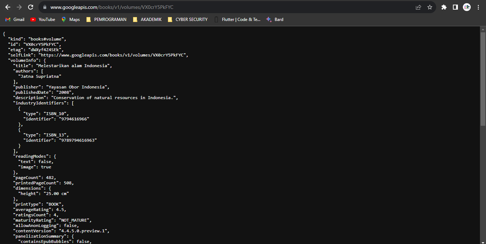
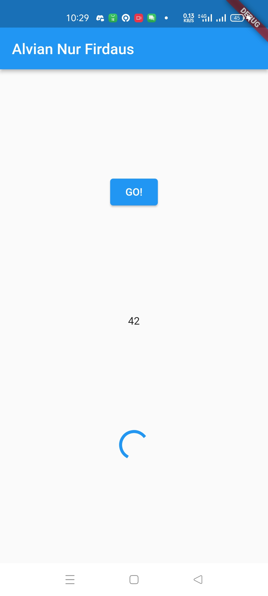

# **Laporan Praktikum**
# **Pertemuan 12**
### **Dasar State Management**
------


### **Data Mahasiswa**


><p>Nama : Alvian Nur Firdaus<p>
>NIM : 2141720022<p>
>Kelas : 3H<p>
>Prodi : D-IV Teknik Inormatika<p>
>Jurusan : Teknologi Inormasi<p>


<br>

### **Tujuan Praktikum**
Setelah menyelesaikan codelab ini Anda akan mampu untuk:

1. menjelaskan konsep arsitektur model-view
2. mengelola data layer dengan InheritedWidget dan InheritedNotifier
3. membuat app state di multiple screens


### **Daftar Isi**

<br>

---------
<br>

### **Praktikum 1: Mengunduh Data dari Web Service (API)**
Selesaikan langkah-langkah praktikum berikut ini menggunakan editor Visual Studio Code (VS Code) atau Android Studio atau code editor lain kesukaan Anda. Jawablah di laporan praktikum Anda pada setiap soal yang ada di beberapa langkah praktikum ini.<p>

>**Perhatian:** Diasumsikan Anda telah berhasil melakukan setup environment Flutter SDK, VS Code, Flutter Plugin, dan Android SDK pada pertemuan pertama.

### **Langkah 1: Buat Project Baru**
Buatlah sebuah project flutter baru dengan nama books di folder src week-12 repository GitHub Anda.<p>

Kemudian Tambahkan dependensi http dengan mengetik perintah berikut di terminal.<p>

```dart
flutter pub add http
```

### **Langkah 2: Cek file pubspec.yaml**
Jika berhasil install plugin, pastikan plugin http telah ada di file pubspec ini seperti berikut.

```dart
dependencies:
  flutter:
    sdk: flutter
  http: ^1.1.0
```

**Jika Anda menggunakan macOS**, Anda harus mengaktifkan fitur networking pada file macos/Runner/DebugProfile.entitlements dan macos/Runner/Release.entitlements dengan menambahkan kode berikut:

<p>

### **Langkah 3: Buka file main.dart**
Ketiklah kode seperti berikut ini.

>Soal 1<p>
>Tambahkan nama panggilan Anda pada title app sebagai identitas hasil pekerjaan Anda.

```dart
import 'package:flutter/material.dart';
import 'dart:async';
import 'package:http/http.dart';
import 'package:http/http.dart' as http;

void main() {
  runApp(const MyApp());
}

class MyApp extends StatelessWidget {
  const MyApp({super.key});

  // This widget is the root of your application.
  @override
  Widget build(BuildContext context) {
    return MaterialApp(
      title: 'Flutter Demo',
      theme: ThemeData(
        primarySwatch: Colors.blue,
        visualDensity: VisualDensity.adaptivePlatformDensity,
      ),
      home: const FuturePage(),
    );
  }
}

class FuturePage extends StatefulWidget {
  const FuturePage({super.key});

  @override
  State<FuturePage> createState() => _FuturePageState();
}

class _FuturePageState extends State<FuturePage> {
  String result = '';

  @override
  Widget build(BuildContext context) {
    return Scaffold(
      appBar: AppBar(
        title: const Text('Alvian Nur Firdaus'),
      ),
      body: Center(
        child: Column(children: [
          const Spacer(),
          ElevatedButton(
            child: const Text('GO!'),
            onPressed: () {},
          ),
          const Spacer(),
          Text(result),
          const Spacer(),
          const CircularProgressIndicator(),
          const Spacer(),
        ]),
      ),
    );
  }
}
```

>Catatan:<p>
>Tidak ada yang spesial dengan kode di main.dart tersebut. Perlu diperhatikan di kode tersebut terdapat widget CircularProgressIndicator yang akan menampilkan animasi berputar secara terus-menerus, itu pertanda bagus bahwa aplikasi Anda responsif (tidak freeze/lag). Ketika animasi terlihat berhenti, itu berarti UI menunggu proses lain sampai selesai.

### **Langkah 4: Tambah method getData()**
Tambahkan method ini ke dalam class _FuturePageState yang berguna untuk mengambil data dari API Google Books.

```dart
Future<Response> getData() async {
    const authority = 'www.googleapis.com';
    const path = '/books/v1/volumes/VX0crY5PkFYC';
    Uri url = Uri.https(authority, path);
    return http.get(url);
}
```

>Soal 2<p>
>- Carilah judul buku favorit Anda di Google Books, lalu ganti ID buku pada variabel path di kode tersebut. Caranya ambil di URL browser Anda seperti gambar berikut ini.
> - Kemudian cobalah akses di browser URI tersebut dengan lengkap seperti ini. Jika menampilkan data JSON, maka Anda telah berhasil. Lakukan capture milik Anda dan tulis di README pada laporan praktikum. Lalu lakukan commit dengan pesan "W12: Soal 2".
><p>

### **Langkah 5: Tambah kode di ElevatedButton**
Tambahkan kode pada onPressed di ElevatedButton seperti berikut.

```dart
ElevatedButton(
            child: const Text('GO!'),
            onPressed: () {
              setState(() {});
              getData().then((value) {
                result = value.body.toString().substring(0, 450);
                setState(() {});
              }).catchError((_) {
                result = 'An error occurred';
                setState(() {});
              });
            },
          ),
```

Lakukan run aplikasi Flutter Anda. Anda akan melihat tampilan akhir seperti gambar berikut. Jika masih terdapat error, silakan diperbaiki hingga bisa running.


>Soal 3<p>
>Jelaskan maksud kode langkah 5 tersebut terkait substring dan catchError!
Capture hasil praktikum Anda berupa GIF dan lampirkan di README. Lalu lakukan commit dengan pesan "W12: Soal 3".


<table>
    <tr>
        <th></th>
        <th></th>
    </tr>
</table>

<br>

-------------


<br>

### **Praktikum 2: Menggunakan await/async untuk menghindari callbacks**
Ada alternatif penggunaan Future yang lebih clean, mudah dibaca dan dirawat, yaitu pola async/await. Intinya pada dua kata kunci ini:
- async digunakan untuk menandai suatu method sebagai asynchronous dan itu harus ditambahkan di depan kode function.
- await digunakan untuk memerintahkan menunggu sampai eksekusi suatu function itu selesai dan mengembalikan sebuah value. Untuk then bisa digunakan pada jenis method apapun, sedangkan await hanya bekerja di dalam method async.

Berikut ini contoh kode perbedaan Future dengan then dan async/await.<p>

<p>

Setelah Anda menyelesaikan praktikum 1, Anda dapat melanjutkan praktikum 2 ini. Selesaikan langkah-langkah praktikum berikut ini menggunakan editor Visual Studio Code (VS Code) atau Android Studio atau code editor lain kesukaan Anda. Jawablah di laporan praktikum Anda pada setiap soal yang ada di beberapa langkah praktikum ini.

>**Perhatian:** Diasumsikan Anda telah berhasil menyelesaikan Praktikum 1.<p>

Pada codelab ini, kita akan menambah kode dari aplikasi books di praktikum sebelumnya.

### **Langkah 1: Buka file main.dart**
Tambahkan tiga method berisi kode seperti berikut di dalam class _FuturePageState.

```dart
Future<int> returnOneAsync() async {
  await Future.delayed(const Duration(seconds: 3));
  return 1;
}

Future<int> returnTwoAsync() async {
  await Future.delayed(const Duration(seconds: 3));
  return 2;
}

Future<int> returnThreeAsync() async {
  await Future.delayed(const Duration(seconds: 3));
  return 3;
}
```

### **Langkah 2: Tambah method count()**
Lalu tambahkan lagi method ini di bawah ketiga method sebelumnya.

```dart
Future count() async {
    int total = 0;
    total = await returnOneAsync();
    total += await returnTwoAsync();
    total += await returnThreeAsync();
    setState(() {
      result = total.toString();
    });
  }
```

### **Langkah 3: Panggil count()**
Lakukan comment kode sebelumnya, ubah isi kode onPressed() menjadi seperti berikut.

```dart
ElevatedButton(
            child: Text('GO!'),
            onPressed: () {
              count();
            }
)
```

### **Langkah 4: Run**
Akhirnya, run atau tekan F5 jika aplikasi belum running. Maka Anda akan melihat seperti gambar berikut, hasil angka 6 akan tampil setelah delay 9 detik.

>Soal 4<p>
>Jelaskan maksud kode langkah 1 dan 2 tersebut!<p>
>Capture hasil praktikum Anda berupa GIF dan lampirkan di README. Lalu lakukan commit dengan pesan "W12: Soal 4".<p>

<table>
    <tr>
        <th></th>
        <th></th>
    </tr>
</table>

<br>

------

<br>

### **Praktikum 3: Menggunakan Completer di Future**
Menggunakan Future dengan then, catchError, async, dan await mungkin sudah cukup untuk banyak kasus, tetapi ada alternatif melakukan operasi async di Dart dan Flutter yaitu dengan class Completer.<p>

Completer membuat object Future yang mana Anda dapat menyelesaikannya nanti (late) dengan return sebuah value atau error.<p>

Setelah Anda menyelesaikan praktikum 2, Anda dapat melanjutkan praktikum 3 ini. Selesaikan langkah-langkah praktikum berikut ini menggunakan editor Visual Studio Code (VS Code) atau Android Studio atau code editor lain kesukaan Anda. Jawablah di laporan praktikum Anda pada setiap soal yang ada di beberapa langkah praktikum ini.<p>

>**Perhatian: Diasumsikan Anda telah berhasil menyelesaikan Praktikum 2.**

### **Langkah 1: Buka main.dart**
Pastikan telah impor package async berikut.

```dart
import 'package:async/async.dart';
```

### **Langkah 2: Tambahkan variabel dan method**
Tambahkan variabel late dan method di class _FuturePageState seperti ini.

```dart
late Completer completer;

Future getNumber() {
  completer = Completer<int>();
  calculate();
  return completer.future;
}

Future calculate() async {
  await Future.delayed(const Duration(seconds : 5));
  completer.complete(42);
}
```

### **Langkah 3: Ganti isi kode onPressed()**
Tambahkan kode berikut pada fungsi onPressed(). Kode sebelumnya bisa Anda comment.

```dart
getNumber().then((value) {
                setState(() {
                  result = value.toString();
                });
              });
```

### **Langkah 4:**
Terakhir, run atau tekan F5 untuk melihat hasilnya jika memang belum running. Bisa juga lakukan hot restart jika aplikasi sudah running. Maka hasilnya akan seperti gambar berikut ini. Setelah 5 detik, maka angka 42 akan tampil.

>Soal 5<p>
>Jelaskan maksud kode langkah 2 tersebut!<p>
>Capture hasil praktikum Anda berupa GIF dan lampirkan di README. Lalu lakukan commit dengan pesan "W12: Soal 5".<p>

<table>
    <tr>
        <th></th>
        <th></th>
    </tr>
</table>

### **Langkah 5: Ganti method calculate()**
Gantilah isi code method calculate() seperti kode berikut, atau Anda dapat membuat calculate2()

```dart
calculate2() async {
    try {
      await new Future.delayed(const Duration(seconds: 5));
      completer.complete(42);
    } catch (_) {
      completer.completeError({});
    }
  }
```

### **Langkah 6: Pindah ke onPressed()
Ganti menjadi kode seperti berikut.**

```dart
getNumber().then((value) {
  setState(() {
    result = value.toString();
  });
}).catchError((e) {
  result = 'An error occurred';
});
```

>Soal 6<p>
>Jelaskan maksud perbedaan kode langkah 2 dengan langkah 5-6 tersebut!<p>
>Capture hasil praktikum Anda berupa GIF dan lampirkan di README. Lalu lakukan commit dengan pesan "W12: Soal 6".<p>

<table>
    <tr>
        <th></th>
        <th></th>
    </tr>
</table>

<br>

-----------------

<br>

### **Praktikum 4: Memanggil Future secara paralel**
Ketika Anda membutuhkan untuk menjalankan banyak Future secara bersamaan, ada sebuah class yang dapat Anda gunakan yaitu: FutureGroup.<p>

FutureGroup tersedia di package async, yang mana itu harus diimpor ke file dart Anda, seperti berikut.

```dart
import 'package:async/async.dart';
```

>**Catatan:** Package dart:async dan async/async.dart merupakan library yang berbeda. Pada beberapa kasus, Anda membutuhkan kedua lib tersebut untuk me-run code async.<p>

FutureGroup adalah sekumpulan dari Future yang dapat run secara paralel. Ketika run secara paralel, maka konsumsi waktu menjadi lebih hemat (cepat) dibanding run method async secara single setelah itu method async lainnya.<p>

Ketika semua code async paralel selesai dieksekusi, maka FutureGroup akan return value sebagai sebuah List, sama juga ketika ingin menambahkan operasi paralel dalam bentuk List.<p>

Setelah Anda menyelesaikan praktikum 3, Anda dapat melanjutkan praktikum 4 ini. Selesaikan langkah-langkah praktikum berikut ini menggunakan editor Visual Studio Code (VS Code) atau Android Studio atau code editor lain kesukaan Anda. Jawablah di laporan praktikum Anda pada setiap soal yang ada di beberapa langkah praktikum ini.<p>

>**Perhatian:** Diasumsikan Anda telah berhasil menyelesaikan Praktikum 3.

### **Langkah 1: Buka file main.dart**
Tambahkan method ini ke dalam class _FuturePageState

```dart
void returnFG() {
    FutureGroup<int> futureGroup = FutureGroup<int>();
    futureGroup.add(returnOneAsync());
    futureGroup.add(returnTwoAsync());
    futureGroup.add(returnThreeAsync());
    futureGroup.close();
    futureGroup.future.then((List<int> value) {
      int total = 0;
      for (var element in value) {
        total += element;
      }
      setState(() {
        result = total.toString();
      });
    });
  }
```

### **Langkah 2: Edit onPressed()**
Anda bisa hapus atau comment kode sebelumnya, kemudian panggil method dari langkah 1 tersebut.

```dart
onPressed: () {
              returnFG();
}
```

### **Langkah 3: Run**
Anda akan melihat hasilnya dalam 3 detik berupa angka 6 lebih cepat dibandingkan praktikum sebelumnya menunggu sampai 9 detik.<p>

>Soal 7<p>
>Capture hasil praktikum Anda berupa GIF dan lampirkan di README. Lalu lakukan commit dengan pesan "W12: Soal 7".<p>

<table>
    <tr>
        <th></th>
        <th></th>
    </tr>
</table>

### **Langkah 4: Ganti variabel futureGroup**
Anda dapat menggunakan FutureGroup dengan Future.wait seperti kode berikut.

```dart
final futures = Future.wait<int>([
  returnOneAsync(),
  returnTwoAsync(),
  returnThreeAsync(),
]);
```

>Soal 8
>Jelaskan maksud perbedaan kode langkah 1 dan 4!


