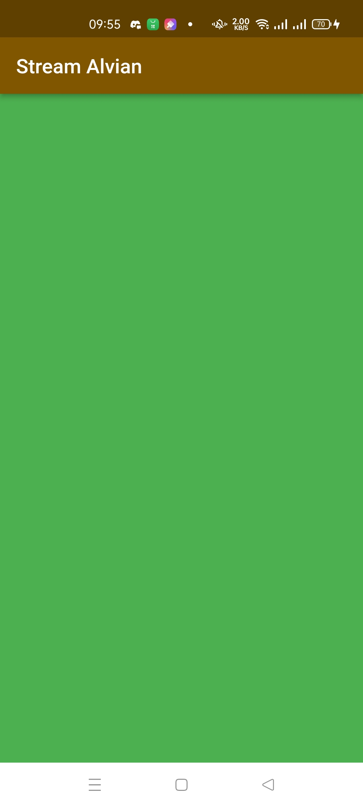

# **Laporan Praktikum**
# **Pertemuan 13**
### **Lanjutan State Management dengan Streams**
------


### **Data Mahasiswa**


><p>Nama : Alvian Nur Firdaus<p>
>NIM : 2141720022<p>
>Kelas : 3H<p>
>Prodi : D-IV Teknik Inormatika<p>
>Jurusan : Teknologi Inormasi<p>


<br>

### **Tujuan Praktikum**
Setelah menyelesaikan codelab ini Anda akan mampu untuk:

1. Menggunakan streams
2. Menggunakan stream controllers dan sinks
3. Menginjeksi transformasi data ke dalam streams
4. Mendaftar di stream events
5. Menggunakan multi stream subscriptions
6. Menggunakan StreamBuilder untuk membuat UI reactive
7. Menggunakan BLoC pattern

<br>

---------
<br>

### **Praktikum 1: Dart Streams**
Selesaikan langkah-langkah praktikum berikut ini menggunakan editor Visual Studio Code (VS Code) atau Android Studio atau code editor lain kesukaan Anda. Jawablah di laporan praktikum Anda (ketik di README.md) pada setiap soal yang ada di beberapa langkah praktikum ini.<p>

>**Perhatian:** Diasumsikan Anda telah berhasil melakukan setup environment Flutter SDK, VS Code, Flutter Plugin, dan Android SDK pada pertemuan pertama

### **Langkah 1: Buat Project Baru**
Buatlah sebuah project flutter baru dengan nama stream_nama (beri nama panggilan Anda) di folder week-13/src/ repository GitHub Anda<p>

### **Langkah 2: Buka file main.dart**
Ketiklah kode seperti berikut ini.

```dart
import 'package:flutter/material.dart';

void main() {
  runApp(const MyApp());
}

class MyApp extends StatelessWidget {
  const MyApp({super.key});

  @override
  Widget build(BuildContext context) {
    return MaterialApp(
      title: 'Stream',
      theme: ThemeData(
        primarySwatch: Colors.deepPurple,
      ),
      home: const StreamHomePage(),
    );
  }
}

class StreamHomePage extends StatefulWidget {
  const StreamHomePage({super.key});

  @override
  State<StreamHomePage> createState() => _StreamHomePageState();
}

class _StreamHomePageState extends State<StreamHomePage> {

  @override
  Widget build(BuildContext context) {
    return Container();
  }
}

```

>Soal 1<p>
>Tambahkan nama panggilan Anda pada title app sebagai identitas hasil pekerjaan Anda.<p>
>Gantilah warna tema aplikasi sesuai kesukaan Anda.<p>
>Lakukan commit hasil jawaban Soal 1 dengan pesan "W13: Jawaban Soal 1"<p>

>**Jawab**<p>
><p>
><p>

<!-- <table>
    <tr>
        <th></th>
        <th></th>
        <th></th>
    </tr>
</table> -->

### **Langkah 3: Buat file baru stream.dart**
Buat file baru di folder lib project Anda. Lalu isi dengan kode berikut.

```dart
import 'package:flutter/material.dart';

class ColorStream {
}
```

### **Langkah 4: Tambah variabel colors**
Tambahkan variabel di dalam class ColorStream seperti berikut.

```dart
import 'package:flutter/material.dart';

class ColorStream {
  final List<Color> colors = [
    Colors.blueGrey,
    Colors.amber,
    Colors.deepPurple,
    Colors.lightBlue,
    Colors.teal,
  ];
}

```

>Soal 2<p>
>Tambahkan 5 warna lainnya sesuai keinginan Anda pada variabel colors tersebut.<p>
>Lakukan commit hasil jawaban Soal 2 dengan pesan "W13: Jawaban Soal 2"<p>

>**Jawab**<p>
><p>

### **Langkah 5: Tambah method getColors()**
Di dalam class ColorStream ketik method seperti kode berikut. Perhatikan tanda bintang di akhir keyword async* (ini digunakan untuk melakukan Stream data)

```dart
Stream<Color> getColors() async* {
}
```

### **Langkah 6: Tambah perintah yield**
Tambahkan kode berikut ini.

```dart
yield* Stream.periodic(
  const Duration(seconds: 1), (int t) {
    int index = t % colors.length;
    return colors[index];
});
```

>Soal 3<p>
>Jelaskan fungsi keyword yield* pada kode tersebut!<p>
>Apa maksud isi perintah kode tersebut?<p>
>Lakukan commit hasil jawaban Soal 3 dengan pesan "W13: Jawaban Soal 3"<p>

>Jawab<p>
>Pada Dart, penggunaan yield* digunakan dalam konteks pengembalian nilai dari suatu fungsi yang juga merupakan generator. Generator adalah fungsi yang menghasilkan serangkaian nilai secara berurutan dan dapat dihentikan atau dilanjutkan.<p>
>Jadi, secara keseluruhan, kode tersebut membuat sebuah stream yang menghasilkan warna dari sebuah array colors secara berulang setiap detik. Kode tersebut hanya mendefinisikan stream dan tidak mencetak atau menggunakan stream tersebut. Untuk menggunakan stream tersebut, Anda dapat menggabungkannya dengan operator .listen atau menggunakannya dalam blok await for jika berada dalam konteks async.<p>

### **Langkah 7: Buka main.dart**
Ketik kode impor file ini pada file main.dart

```dart
import 'stream.dart';
```

### **Langkah 8: Tambah variabel**
Ketik dua properti ini di dalam class _StreamHomePageState

```dart
Color bgColor = Colors.blueGrey;
  late ColorStream colorStream;
```

### **Langkah 9: Tambah method changeColor()**
Tetap di file main, Ketik kode seperti berikut

```dart
void changeColor() async {
    await for (var eventColor in colorStream.getColors()) {
      setState(() {
        bgColor = eventColor;
      });
    }
  }
```

### **Langkah 10: Lakukan override initState()**
Ketika kode seperti berikut

```dart
@override
  void initState() {
    super.initState();
    colorStream = ColorStream();
    changeColor();
  }
```

### **Langkah 11: Ubah isi Scaffold()**
Sesuaikan kode seperti berikut.

```dart
return Scaffold(
      appBar: AppBar(
        title: const Text ('Stream Alvian'),
      ),
      body: Container(
        decoration: BoxDecoration(color: bgColor),
      ));
```

### **Langkah 12: Run**
Lakukan running pada aplikasi Flutter Anda, maka akan terlihat berubah warna background setiap detik.

>Soal 4<p>
>Capture hasil praktikum Anda berupa GIF dan lampirkan di README.<p>
>Lakukan commit hasil jawaban Soal 4 dengan pesan "W13: Jawaban Soal 4"<p>

<table>
    <tr>
        <th></th>
        <th></th>
        <th></th>
    </tr>
</table>

### **Langkah 13: Ganti isi method changeColor()**
Anda boleh comment atau hapus kode sebelumnya, lalu ketika kode seperti berikut.

```dart
colorStream.getColors().listen((eventColor) {
      setState(() {
        bgColor = eventColor;
      });
    });
```

>Soal 5<p>
>Jelaskan perbedaan menggunakan listen dan await for (langkah 9) !<p>
>Lakukan commit hasil jawaban Soal 5 dengan pesan "W13: Jawaban Soal 5"<p>

>Jawab<p>
>Kedua pendekatan tersebut, yakni menggunakan await for dan listen, berfungsi untuk mendengarkan perubahan pada stream, tetapi terdapat perbedaan utama dalam cara mereka berinteraksi dengan stream.<p>
>- await for mengharapkan fungsi yang dilabeli async, sementara listen dapat digunakan di dalam atau di luar fungsi yang diberi label async.<p>
>- await for digunakan untuk membuat loop yang akan terus menunggu dan mendengarkan stream, sementara listen digunakan untuk menetapkan fungsi callback yang akan dipanggil setiap kali ada perubahan pada stream.<p>
>
>Dalam kedua kasus, tujuannya tetap sama, yaitu merespons perubahan pada stream dan memperbarui UI melalui setState ketika ada perubahan warna. Pilihan antara keduanya tergantung pada kebutuhan dan struktur kode aplikasi Flutter Anda.<p>

<br>
>**Catatan:** Stream di Flutter memiliki fitur yang powerfull untuk menangani data secara async. Stream dapat dimanfaatkan pada skenario dunia nyata seperti real-time messaging, unggah dan unduh file, tracking lokasi user, bekerja dengan data sensor IoT, dan lain sebagainya.

<br>

-----

<br>

### **Praktikum 2: Stream controllers dan sinks**
StreamControllers akan membuat jembatan antara Stream dan Sink. Stream berisi data secara sekuensial yang dapat diterima oleh subscriber manapun, sedangkan Sink digunakan untuk mengisi (injeksi) data.<p>

Secara sederhana, StreamControllers merupakan stream management. Ia akan otomatis membuat stream dan sink serta beberapa method untuk melakukan kontrol terhadap event dan fitur-fitur yang ada di dalamnya.<p>

Anda dapat membayangkan stream sebagai pipa air yang mengalir searah, dari salah satu ujung Anda dapat mengisi data dan dari ujung lain data itu keluar. Anda dapat melihat konsep stream pada gambar diagram berikut ini.<p>


<p>

Di Flutter, Anda dapat menggunakan StreamController untuk mengontrol aliran data stream. Sebuah StreamController memiliki sebuah properti bernama sink yang berguna untuk insert data. Sedangkan properti stream berguna untuk menerima atau keluarnya data dari StreamController tersebut.<p>

Setelah Anda menyelesaikan praktikum 1, Anda dapat melanjutkan praktikum 2 ini. Selesaikan langkah-langkah praktikum berikut ini menggunakan editor Visual Studio Code (VS Code) atau Android Studio atau code editor lain kesukaan Anda. Jawablah di laporan praktikum Anda pada setiap soal yang ada di beberapa langkah praktikum ini.<p>

>**Perhatian:** Diasumsikan Anda telah berhasil menyelesaikan Praktikum 1.<p>

Pada codelab ini, kita akan menambah kode dari aplikasi stream di praktikum sebelumnya.

### **1: Buka file stream.dart**
Lakukan impor dengan mengetik kode ini.

```dart
import 'dart:async';
```

### **Langkah 2: Tambah class NumberStream**
Tetap di file stream.dart tambah class baru seperti berikut.

```dart
class NumberStream{
  
}
```

### **Langkah 3: Tambah StreamController**
Di dalam class NumberStream buatlah variabel seperti berikut.

```dart
final StreamController<int> controller = StreamController<int>();
```

### **Langkah 4: Tambah method addNumberToSink**
Tetap di class NumberStream buatlah method ini

```dart
void addNumberToSink(int newNumber) {
    controller.sink.add(newNumber);
  }
```

### **Langkah 5: Tambah method close()**

```dart
close() {
    controller.close();
  }
```

### **Langkah 6: Buka main.dart**
Ketik kode import seperti berikut

```dart
import 'dart:async';
import 'dart:math';
```

### **Langkah 7: Tambah variabel**
Di dalam class _StreamHomePageState ketik variabel berikut

```dart
int lastNumber = 0;
  late StreamController numberStreamController;
  late NumberStream numberStream;
```

### **Langkah 8: Edit initState()**

```dart
@override
  void initState() {
    numberStream = NumberStream();
    numberStreamController = numberStream.controller;
    Stream stream = numberStreamController.stream;
    stream.listen((event) {
      setState(() {
        lastNumber = event;
      });
    });
    super.initState();
  }
```

### **Langkah 9: Edit dispose()**

```dart
@override
  void dispose() {
    numberStreamController.close();
    super.dispose();
  }
```

### **10: Tambah method addRandomNumber()**

```dart
void addRandomNumber() {
  Random random = Random();
  int myNum = random.nextInt(10);
  numberStream.addNumberToSink(myNum);
}
```

### **Langkah 11: Edit method build()**

```dart
body: SizedBox(
        width: double.infinity,
        child: Column(
          mainAxisAlignment: MainAxisAlignment.spaceEvenly,
          crossAxisAlignment: CrossAxisAlignment.center,
          children: [
            Text(lastNumber.toString()),
            ElevatedButton(
              onPressed: () => addRandomNumber(), 
              child: Text('New Random Number'),
              )
          ],
        ),
      ),
```

### **Langkah 12: Run**
Lakukan running pada aplikasi Flutter Anda, maka akan terlihat seperti gambar berikut.

>Soal 6<p>
>Jelaskan maksud kode langkah 8 dan 10 tersebut!<p>
>Capture hasil praktikum Anda berupa GIF dan lampirkan di README.<p>
>Lalu lakukan commit dengan pesan "W13: Jawaban Soal 6".<p>

>Jawab<p>
>Secara keseluruhan, langkah 8 dan 10 ini menciptakan dan mengelola stream angka dengan menggunakan NumberStream, menginisialisasi stream controller, mendengarkan perubahan pada stream, dan menambahkan angka acak ke dalam stream.<p>

<table>
    <tr>
        <th></th>
        <th></th>
    </tr>
</table>

### **Langkah 13: Buka stream.dart**
Tambahkan method berikut ini.

```dart
addError() {
    controller.sink.addError('error');
  }
```

### **Langkah 14: Buka main.dart**
Tambahkan method onError di dalam class StreamHomePageState pada method listen di fungsi initState() seperti berikut ini.

```dart
stream.listen((event){
    setState((){
      lastNumber = event;
    });
  }).onError((error){
    setState((){
      lastNumber = -1;
    });
  });

```

### **Langkah 15: Edit method addRandomNumber()**
Lakukan comment pada dua baris kode berikut, lalu ketik kode seperti berikut ini.

```dart
void addRandomNumber() {
    Random random = Random();
    // int myNum = random.nextInt(10);
    // numberStream.addNumberToSink(myNum);
    numberStream.addError();
  }
```

>Soal 7<p>
>Jelaskan maksud kode langkah 13 sampai 15 tersebut!<p>
>Kembalikan kode seperti semula pada Langkah 15, comment addError() agar Anda dapat melanjutkan ke praktikum 3 berikutnya.<p>
>Lalu lakukan commit dengan pesan "W13: Jawaban Soal 7".<p>

>Jawab<p>
>**Pada langkah 13**Pada langkah ini, Anda menambahkan sebuah metode bernama addError() ke dalam objek NumberStream yang mungkin merupakan suatu kelas yang mengelola stream angka. Metode ini bertujuan untuk menambahkan pesan error ke dalam sink (tempat penyimpanan) stream dengan menggunakan controller.sink.addError('error').<p>
>**Pada langkah 14**Pada langkah ini, Anda menambahkan metode onError ke dalam fungsi listen yang mendengarkan perubahan pada stream dalam fungsi initState(). Ketika terjadi error pada stream, fungsi onError akan dipanggil, dan Anda mengupdate nilai lastNumber menjadi -1. Ini memberikan cara untuk menangani kesalahan yang mungkin terjadi pada stream.<p>
>**Pada langkah 15**Pada langkah ini, Anda melakukan komentar pada dua baris kode yang awalnya digunakan untuk menambahkan angka acak ke dalam stream. Ini berarti bahwa metode addRandomNumber() sekarang tidak melakukan apa pun, dan angka tidak lagi ditambahkan ke dalam stream.<p>

<br>

-----

<br>

### **Praktikum 3: Injeksi data ke streams**
Skenario yang umum dilakukan adalah melakukan manipulasi atau transformasi data stream sebelum sampai pada UI end user. Hal ini sangatlah berguna ketika Anda membutuhkan untuk filter data berdasarkan kondisi tertentu, melakukan validasi data, memodifikasinya, atau melakukan proses lain yang memicu beberapa output baru. Contohnya melakukan konversi angka ke string, membuat sebuah perhitungan, atau menghilangkan data yang berulang terus tampil.<p>

Pada praktikum 3 ini, Anda akan menggunakan StreamTransformers ke dalam stream untuk melakukan map dan filter data.<p>

Setelah Anda menyelesaikan praktikum 2, Anda dapat melanjutkan praktikum 3 ini. Selesaikan langkah-langkah praktikum berikut ini menggunakan editor Visual Studio Code (VS Code) atau Android Studio atau code editor lain kesukaan Anda. Jawablah di laporan praktikum Anda pada setiap soal yang ada di beberapa langkah praktikum ini.<p>

>**Perhatian:** Diasumsikan Anda telah berhasil menyelesaikan Praktikum 2.<p>

### **Langkah 1: Buka main.dart**
Tambahkan variabel baru di dalam class _StreamHomePageState

```dart
late StreamTransformer transformer;
```

### **Langkah 2: Tambahkan kode ini di initState**

```dart
transformer = StreamTransformer<int, int>.fromHandlers(
        handleData: (value, sink) {
          sink.add(value * 10);
        },
        handleError: (error, trace, sink) {
          sink.add(-1);
        },
        handleDone: (sink) => sink.close());
```

### **Langkah 3: Tetap di initState**
Lakukan edit seperti kode berikut.

```dart
stream.transform(transformer).listen((event) {
      setState(() {
        lastNumber = event;
      });
    }).onError((error) {
      setState(() {
        lastNumber = -1;
      });
    });
    super.initState();
```

### **Langkah 4: Run**
Terakhir, run atau tekan F5 untuk melihat hasilnya jika memang belum running. Bisa juga lakukan hot restart jika aplikasi sudah running. Maka hasilnya akan seperti gambar berikut ini. Anda akan melihat tampilan angka dari 0 hingga 90.

>Soal 8<p>
>Jelaskan maksud kode langkah 1-3 tersebut!<p>
>Capture hasil praktikum Anda berupa GIF dan lampirkan di README.<p>
>Lalu lakukan commit dengan pesan "W13: Jawaban Soal 8".<p>

>Jawab<p>
>**Langkah 1**Pada langkah ini, Anda menambahkan variabel transformer ke dalam kelas _StreamHomePageState. Variabel ini memiliki tipe StreamTransformer, yang merupakan objek yang dapat mengubah (transform) nilai di dalam stream.<p>
>**Langkah2**Pada langkah ini, Anda membuat objek StreamTransformer dengan menggunakan metode fromHandlers. Objek ini digunakan untuk mengubah nilai di dalam stream. Dalam kasus ini, nilai diubah dengan mengalikan setiap nilai dengan 10. Selain itu, terdapat penanganan error yang menghasilkan nilai -1, dan penanganan ketika stream selesai.<p>
>**Langkah3**Pada langkah ini, Anda menggunakan transform pada stream untuk menerapkan transformasi yang telah ditentukan oleh transformer. Setiap nilai yang masuk ke dalam stream akan dikalikan dengan 10 sesuai dengan logika yang didefinisikan dalam transformer. Selanjutnya, Anda mendengarkan perubahan pada stream seperti biasa dan memperbarui UI melalui setState.<p>


<table>
    <tr>
        <th></th>
        <th></th>
    </tr>
</table>

<br>

-----

<br>

### **Praktikum 4: Subscribe ke stream events**
Dari praktikum sebelumnya, Anda telah menggunakan method listen mendapatkan nilai dari stream. Ini akan menghasilkan sebuah Subscription. Subscription berisi method yang dapat digunakan untuk melakukan listen pada suatu event dari stream secara terstruktur.<p>

Pada praktikum 4 ini, kita akan gunakan Subscription untuk menangani event dan error dengan teknik praktik baik (best practice), dan menutup Subscription tersebut.<p>

Setelah Anda menyelesaikan praktikum 3, Anda dapat melanjutkan praktikum 4 ini. Selesaikan langkah-langkah praktikum berikut ini menggunakan editor Visual Studio Code (VS Code) atau Android Studio atau code editor lain kesukaan Anda. Jawablah di laporan praktikum Anda pada setiap soal yang ada di beberapa langkah praktikum ini.<p>

>**Perhatian:** Diasumsikan Anda telah berhasil menyelesaikan Praktikum 3.<p>

### **Langkah 1: Tambah variabel**
Tambahkan variabel berikut di class _StreamHomePageState

```dart
late StreamSubscription subscription;
```

### **Langkah 2: Edit initState()**
Edit kode seperti berikut ini.

```dart
@override
  void initState() {
    super.initState();
    numberStream = NumberStream();
    numberStreamController = numberStream.controller;
    Stream stream = numberStreamController.stream;
    subscription = stream.listen((event) {
      setState(() {
        lastNumber = event;
      });
    });
    super.initState();
  }
```

### **Langkah 3: Tetap di initState()**
Tambahkan kode berikut ini.

```dart
subscription.onError((error) {
      setState(() {
        lastNumber = -1;
      });
    });
```

### **Langkah 4: Tambah properti onDone()**
Tambahkan dibawahnya kode ini setelah onError

```dart
subscription.onDone(() {
      print('OnDone was called');
    });
```

### **Langkah 5: Tambah method baru**
Ketik method ini di dalam class _StreamHomePageState

```dart
void stopStream() {
    numberStreamController.close();
  }
```

### **Langkah 6: Pindah ke method dispose()**
Jika method dispose() belum ada, Anda dapat mengetiknya dan dibuat override. Ketik kode ini didalamnya.

```dart
subscription.cancel();
```

### **Langkah 7: Pindah ke method build()**
Tambahkan button kedua dengan isi kode seperti berikut ini.

```dart
ElevatedButton(
              onPressed: () => stopStream(),
              child: const Text('Stop Subscription'),
            )
```

### **Langkah 8: Edit method addRandomNumber()**
Edit kode seperti berikut ini.

```dart
void addRandomNumber() {
    Random random = Random();
    int myNum = random.nextInt(10);
    if (!numberStreamController.isClosed) {
      numberStream.addNumberToSink(myNum);
    } else {
      setState(() {
        lastNumber = -1;
      });
    }
  }
```

### **Langkah 9: Run**
Anda akan melihat dua button seperti gambar berikut.

### **Langkah 10: Tekan button ‘Stop Subscription**
Anda akan melihat pesan di Debug Console seperti berikut.<p>


>Soal 9<p>
>Jelaskan maksud kode langkah 2, 6 dan 8 tersebut!<p>
>Capture hasil praktikum Anda berupa GIF dan lampirkan di README.<p>
>Lalu lakukan commit dengan pesan "W13: Jawaban Soal 9".<p>


>Jawab<p>
>Langkah 2<p>
>Pada langkah ini, Anda sedang mengedit metode initState() dalam framework Flutter. initState() adalah metode yang dipanggil setelah widget telah diinisialisasi, dan ini sering digunakan untuk melakukan konfigurasi awal dan memulai sumber daya yang diperlukan.<p>
>Langkah 6<p>
>Langkah ini menunjukkan bagaimana menangani pembuangan (disposing) sumber daya yang digunakan oleh widget. Metode dispose() dipanggil ketika widget dihapus dari pohon widget.<p>
>Langkah 8<p>
>Dengan langkah ini, memberikan fungsionalitas untuk menambahkan angka acak ke aliran sesuai dengan kondisi-kondisi tertentu, dan Anda menangani dengan bijak situasi di mana kontroler aliran sudah ditutup.


<table>
    <tr>
        <th></th>
        <th></th>
    </tr>
</table>
