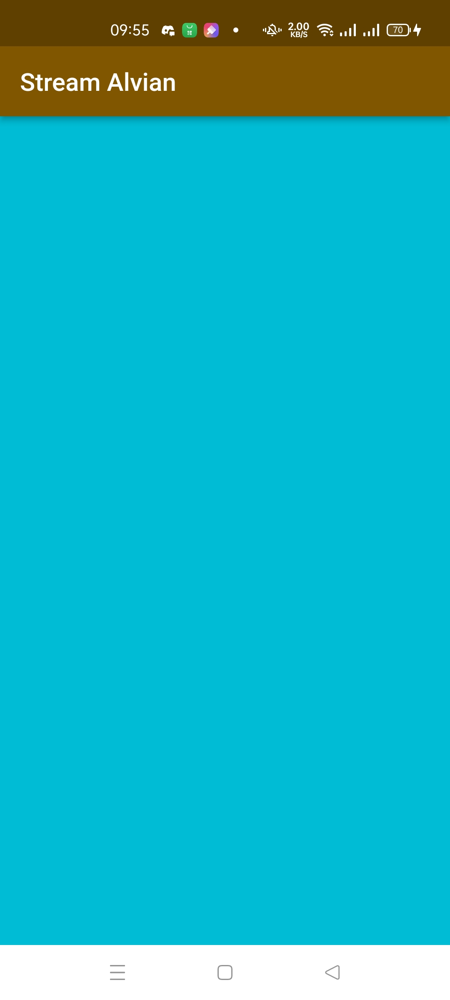

# **Laporan Praktikum**
# **Pertemuan 13**
### **Lanjutan State Management dengan Streams**
------


### **Data Mahasiswa**


><p>Nama : Alvian Nur Firdaus<p>
>NIM : 2141720022<p>
>Kelas : 3H<p>
>Prodi : D-IV Teknik Inormatika<p>
>Jurusan : Teknologi Inormasi<p>


<br>

### **Tujuan Praktikum**
Setelah menyelesaikan codelab ini Anda akan mampu untuk:

1. Menggunakan streams
2. Menggunakan stream controllers dan sinks
3. Menginjeksi transformasi data ke dalam streams
4. Mendaftar di stream events
5. Menggunakan multi stream subscriptions
6. Menggunakan StreamBuilder untuk membuat UI reactive
7. Menggunakan BLoC pattern

<br>

---------
<br>

### **Praktikum 1: Dart Streams**
Selesaikan langkah-langkah praktikum berikut ini menggunakan editor Visual Studio Code (VS Code) atau Android Studio atau code editor lain kesukaan Anda. Jawablah di laporan praktikum Anda (ketik di README.md) pada setiap soal yang ada di beberapa langkah praktikum ini.<p>

>**Perhatian:** Diasumsikan Anda telah berhasil melakukan setup environment Flutter SDK, VS Code, Flutter Plugin, dan Android SDK pada pertemuan pertama

### **Langkah 1: Buat Project Baru**
Buatlah sebuah project flutter baru dengan nama stream_nama (beri nama panggilan Anda) di folder week-13/src/ repository GitHub Anda<p>

### **Langkah 2: Buka file main.dart**
Ketiklah kode seperti berikut ini.

```dart
import 'package:flutter/material.dart';

void main() {
  runApp(const MyApp());
}

class MyApp extends StatelessWidget {
  const MyApp({super.key});

  @override
  Widget build(BuildContext context) {
    return MaterialApp(
      title: 'Stream',
      theme: ThemeData(
        primarySwatch: Colors.deepPurple,
      ),
      home: const StreamHomePage(),
    );
  }
}

class StreamHomePage extends StatefulWidget {
  const StreamHomePage({super.key});

  @override
  State<StreamHomePage> createState() => _StreamHomePageState();
}

class _StreamHomePageState extends State<StreamHomePage> {

  @override
  Widget build(BuildContext context) {
    return Container();
  }
}

```

>Soal 1<p>
>Tambahkan nama panggilan Anda pada title app sebagai identitas hasil pekerjaan Anda.<p>
>Gantilah warna tema aplikasi sesuai kesukaan Anda.<p>
>Lakukan commit hasil jawaban Soal 1 dengan pesan "W13: Jawaban Soal 1"<p>

>**Jawab**<p>
><p>
><p>

<!-- <table>
    <tr>
        <th></th>
        <th></th>
        <th></th>
    </tr>
</table> -->

### **Langkah 3: Buat file baru stream.dart**
Buat file baru di folder lib project Anda. Lalu isi dengan kode berikut.

```dart
import 'package:flutter/material.dart';

class ColorStream {
}
```

### **Langkah 4: Tambah variabel colors**
Tambahkan variabel di dalam class ColorStream seperti berikut.

```dart
import 'package:flutter/material.dart';

class ColorStream {
  final List<Color> colors = [
    Colors.blueGrey,
    Colors.amber,
    Colors.deepPurple,
    Colors.lightBlue,
    Colors.teal,
  ];
}

```

>Soal 2<p>
>Tambahkan 5 warna lainnya sesuai keinginan Anda pada variabel colors tersebut.<p>
>Lakukan commit hasil jawaban Soal 2 dengan pesan "W13: Jawaban Soal 2"<p>

>**Jawab**<p>
><p>

### **Langkah 5: Tambah method getColors()**
Di dalam class ColorStream ketik method seperti kode berikut. Perhatikan tanda bintang di akhir keyword async* (ini digunakan untuk melakukan Stream data)

```dart
Stream<Color> getColors() async* {
}
```

### **Langkah 6: Tambah perintah yield**
Tambahkan kode berikut ini.

```dart
yield* Stream.periodic(
  const Duration(seconds: 1), (int t) {
    int index = t % colors.length;
    return colors[index];
});
```

>Soal 3<p>
>Jelaskan fungsi keyword yield* pada kode tersebut!<p>
>Apa maksud isi perintah kode tersebut?<p>
>Lakukan commit hasil jawaban Soal 3 dengan pesan "W13: Jawaban Soal 3"<p>

>Jawab<p>
>Pada Dart, penggunaan yield* digunakan dalam konteks pengembalian nilai dari suatu fungsi yang juga merupakan generator. Generator adalah fungsi yang menghasilkan serangkaian nilai secara berurutan dan dapat dihentikan atau dilanjutkan.<p>
>Jadi, secara keseluruhan, kode tersebut membuat sebuah stream yang menghasilkan warna dari sebuah array colors secara berulang setiap detik. Kode tersebut hanya mendefinisikan stream dan tidak mencetak atau menggunakan stream tersebut. Untuk menggunakan stream tersebut, Anda dapat menggabungkannya dengan operator .listen atau menggunakannya dalam blok await for jika berada dalam konteks async.<p>

### **Langkah 7: Buka main.dart**
Ketik kode impor file ini pada file main.dart

```dart
import 'stream.dart';
```

### **Langkah 8: Tambah variabel**
Ketik dua properti ini di dalam class _StreamHomePageState

```dart
Color bgColor = Colors.blueGrey;
  late ColorStream colorStream;
```

### **Langkah 9: Tambah method changeColor()**
Tetap di file main, Ketik kode seperti berikut

```dart
void changeColor() async {
    await for (var eventColor in colorStream.getColors()) {
      setState(() {
        bgColor = eventColor;
      });
    }
  }
```

### **Langkah 10: Lakukan override initState()**
Ketika kode seperti berikut

```dart
@override
  void initState() {
    super.initState();
    colorStream = ColorStream();
    changeColor();
  }
```

### **Langkah 11: Ubah isi Scaffold()**
Sesuaikan kode seperti berikut.

```dart
return Scaffold(
      appBar: AppBar(
        title: const Text ('Stream Alvian'),
      ),
      body: Container(
        decoration: BoxDecoration(color: bgColor),
      ));
```

### **Langkah 12: Run**
Lakukan running pada aplikasi Flutter Anda, maka akan terlihat berubah warna background setiap detik.

>Soal 4<p>
>Capture hasil praktikum Anda berupa GIF dan lampirkan di README.<p>
>Lakukan commit hasil jawaban Soal 4 dengan pesan "W13: Jawaban Soal 4"<p>

<table>
    <tr>
        <th></th>
        <th></th>
        <th></th>
    </tr>
</table>

### **Langkah 13: Ganti isi method changeColor()**
Anda boleh comment atau hapus kode sebelumnya, lalu ketika kode seperti berikut.

```dart
colorStream.getColors().listen((eventColor) {
      setState(() {
        bgColor = eventColor;
      });
    });
```

>Soal 5<p>
>Jelaskan perbedaan menggunakan listen dan await for (langkah 9) !<p>
>Lakukan commit hasil jawaban Soal 5 dengan pesan "W13: Jawaban Soal 5"<p>

>Jawab<p>
>Kedua pendekatan tersebut, yakni menggunakan await for dan listen, berfungsi untuk mendengarkan perubahan pada stream, tetapi terdapat perbedaan utama dalam cara mereka berinteraksi dengan stream.<p>
>- await for mengharapkan fungsi yang dilabeli async, sementara listen dapat digunakan di dalam atau di luar fungsi yang diberi label async.<p>
>- await for digunakan untuk membuat loop yang akan terus menunggu dan mendengarkan stream, sementara listen digunakan untuk menetapkan fungsi callback yang akan dipanggil setiap kali ada perubahan pada stream.<p>
>
>Dalam kedua kasus, tujuannya tetap sama, yaitu merespons perubahan pada stream dan memperbarui UI melalui setState ketika ada perubahan warna. Pilihan antara keduanya tergantung pada kebutuhan dan struktur kode aplikasi Flutter Anda.

